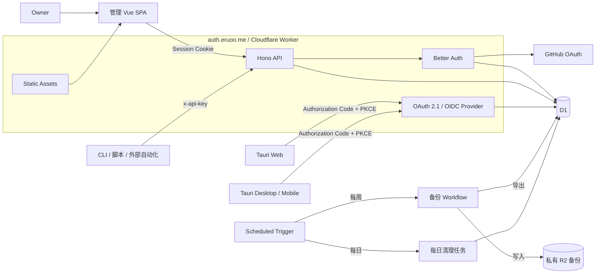

# eruoo-server 产品与技术规格

> 状态：实现中；设计决策已收口，外部状态变更保留人工关口
> 最后更新：2026-08-23
> 代码仓库：`eruoo/server`
> 生产 Origin：`https://auth.eruoo.me`

本文档是 eruoo-server 产品范围、架构、安全模型和交付约束的单一事实来源。第 1 至 25 节是设计基线；第 23 节中的额度是外部事实快照，第 26 节是当前实施切片，第 27 节定义实施授权与外部操作门禁，第 28 节是由前述内容派生的风险。

## 1. 产品定位

eruoo-server 是供 owner 本人使用的统一服务端，承担以下职责：

- 为管理 SPA，以及 Tauri Web、Desktop、Mobile 客户端提供身份认证与业务 API。
- 为本机 CLI、脚本和外部自动化提供受控的 API Key 调用能力。
- 提供同源的个人管理 SPA，用于管理 Passkey、API Key、已授权应用和安全审计事件。
- 作为 OAuth 2.1 与 OpenID Connect 发行者，为自己的 Tauri 多端应用签发 access token 和 refresh token。
- 以 OpenAPI 3.1 作为 HTTP API 的唯一长期契约。

首期只有一个 owner，不建设开放注册、多用户协作、B2B Organization 或公共身份平台。架构应允许未来增加自己的客户端，但不为尚不存在的公众用户提前引入多租户复杂度。

### 1.1 明确不做

初期不引入以下能力：

- 用户名密码、邮件验证码、短信验证码和公开注册。
- Cloudflare Access 作为应用身份系统。
- 微服务、Kafka、Kubernetes、GraphQL、Redis、service mesh。
- Hono RPC 作为公共客户端契约。
- 永久预发布环境。
- Sentry、OpenTelemetry、Logpush、Tail Worker、Analytics Engine、Workers Traces。
- 面向外部用户的 OAuth 动态客户端注册和 OAuth 客户端管理界面。
- 每台设备独立的授权记录模型。
- 定期季度恢复演练。

## 2. 系统全景



### 2.1 核心边界

- 一个 GitHub 仓库、一个根 `package.json`、一个 Worker 项目和一次生产部署。
- Hono API 与 Vue SPA 静态资源使用同一 Worker 和同一域名。
- GitHub OAuth 只负责上游 owner 身份确认。
- Better Auth 负责应用 Session、Passkey、API Key 和相关身份数据。
- 本服务的 OAuth 2.1/OIDC Provider 为 Tauri 客户端签发本服务自己的 token。
- Hono 负责请求入口、协议适配、验证和粗粒度授权。
- 业务层只接收统一的 `Principal`，不得依赖 GitHub、Better Auth 或某一种 token 的原始结构。
- D1 存储关系型身份、授权、业务和审计数据。
- R2 只存储长期数据库导出文件，不替代 D1。

D1 面向表、索引和关系查询，所有在线认证与业务状态都从 D1 读取。R2 面向不可变对象和大文件，本项目只把它用于保存 SQL 备份对象。认证请求不得以 R2 作为在线数据源。

## 3. 技术选型

| 层级 | 采用方案 | 约束 |
| --- | --- | --- |
| 语言 | TypeScript 6.x stable | 开启严格类型检查；精确版本由 `package.json` 和 lockfile 固定 |
| 本地与 CI 工具链 | Node.js 24.x | 精确版本由仓库工具链和 CI 固定 |
| 生产运行时 | Cloudflare Workers Runtime | 实际运行时是 workerd，不是 Node.js 服务器 |
| 包管理 | pnpm 11 stable | 精确版本和完整性摘要由 `packageManager` 固定；提交 lockfile |
| 代码质量 | Oxlint、Oxfmt | 不引入 ESLint 或 Prettier；不启用 Oxlint type-aware |
| HTTP 框架 | Hono | 面向 Web Standards 与 Workers |
| Schema | Zod | 请求验证、领域边界和 OpenAPI schema |
| API 契约 | `@hono/zod-openapi`、OpenAPI 3.1 | OpenAPI 是唯一公共契约 |
| 身份系统 | Better Auth 1.7.x stable | GitHub OAuth、Passkey、Session、API Key、OAuth/OIDC Provider |
| 数据库 | Cloudflare D1 | 本地通过 Wrangler 使用本地 D1 |
| 业务 ORM | Drizzle ORM | 使用稳定版本，不追 RC 或实验性 joins |
| 前端 | Vue 3、Vite、Vue Router、Cloudflare Vite plugin | Composition API、`<script setup lang="ts">` |
| UI | `@ayingott/theme`、Tailwind CSS 4、Reka UI、Lucide | theme 提供 token，Reka 提供无样式可访问原语 |
| API 文档 | Scalar | 私有、只读、同源自托管固定版本资源 |
| 单元与集成测试 | Vitest、Cloudflare Workers 测试生态 | 不引入 Jest |
| E2E | Playwright | 覆盖关键浏览器流程 |
| 部署 | Cloudflare Workers Builds | GitHub 集成触发构建与部署 |

### 3.1 选型理由和被替代方案

- Fastify 是 Node.js 生态的 JavaScript/TypeScript 框架，但本项目最终运行在 Workers，因此采用原生适配 workerd 的 Hono。
- Bun、Elysia 和 Bun 上的 Fastify/Nest 不再作为本项目基线。Node.js 只承担工具链，生产依赖 Workers Runtime。
- OpenAPI 适合跨 Web、Rust/Tauri、CLI 和未来其他语言客户端的长期契约，因此不采用只适合同一 TypeScript 仓库同步发布的 Hono RPC。
- Better Auth 与 Cloudflare Access 不是同一类能力。Better Auth 是应用身份与授权层，Cloudflare Access 是外围零信任访问控制。初期使用 Better Auth，不要求 Cloudflare Access。
- Drizzle 是当前 Workers 与 D1 业务数据层的默认选择。Prisma 的 D1 支持和迁移路径不作为当前基线。
- Better Auth 自身直接使用原生 D1 binding，业务查询才使用 Drizzle，所以不是所有数据库操作都经过 Drizzle。
- Better Auth 拥有其内部身份表的 schema 和日期表示，migration 必须与同版本官方 D1 adapter 的生成结果保持一致；业务代码不得用 Drizzle 重新建模或改写这些内部表。
- `@ayingott/theme` 加 Reka UI 已足以构建设计系统和管理台。暂不引入 shadcn-vue、Nuxt UI、PrimeVue 或第二套视觉组件库。

本规格使用的 protected resource、resource-bound JWT 和 refresh retry/reuse 语义依赖 Better Auth 1.7。核心包及全部 `@better-auth/*` 插件必须使用同一稳定版本，不得降级到 1.6 或改用 RC。精确版本只在 `package.json` 和 lockfile 中维护。

Better Auth Core 1.7.0 在 Workers 中仍存在首次异步初始化随请求中断而失效的上游问题。仓库通过 pnpm `patchedDependencies` 精确移植仅针对 `globalThis.AsyncLocalStorage` 解析路径的上游修复，并在依赖测试和生产 bundle 门禁中验证补丁仍然生效；不得手工修改 `node_modules` 或扩大补丁范围。运行时只把 `$context` 已成功完成的 Auth 实例写入 isolate 级 WeakMap，pending 或失败的实例不进入共享缓存，因此后续请求可以重新初始化；并发成功时只保留一个 resolved winner。升级 Better Auth 时必须先在真实 workerd 中验证上游已同时解决初始化与缓存问题，才能移除本地补丁和对应门禁。

Better Auth OAuth Provider 1.7.0 的 refresh-family invalidation 默认按 `(clientId, userId)` 删除，会误伤相同 owner 与 client 的另一条独立授权，并且其多次 adapter 删除不具备跨请求原子性；revocation catch 还错误读取 `APIError.name` 而不是 `status`，使已轮换或未知 refresh token 的 RFC 7009 幂等撤销返回 400，且按错误 `token_type_hint` 查找失败后不会继续搜索另一种受支持类型；client plugin 则会把当前签名 query 注入所有非 GET/DELETE 请求，server before hook 也会在任意携带 `oauth_query` 的认证路径恢复 continuation。仓库通过第二个精确的 pnpm 补丁分别增加 `authorizationCodeId` family 谓词、让 revocation 按 hint 优先但在未命中后继续搜索另一种类型、按 `error.status` 吞掉应幂等成功的 revocation 错误并返回 200 空 body、只允许 client plugin 在 `POST /api/auth/sign-in/social` 与 `POST /api/auth/passkey/verify-authentication` 注入 continuation，并把 server hook 限制在内部路径 `/sign-in/social`、`/passkey/verify-authentication`、`/oauth2/consent` 与 `/oauth2/continue`。应用层 family tombstone 负责把超窗 reuse、Native refresh-token revoke、owner 撤销与并发 successor 线性化。依赖测试必须同时验证补丁文件、lockfile hash、安装产物和全部调用边界；升级插件时只有在真实 workerd/D1 证明上游同时解决这些问题后才能移除对应补丁。

Oxlint 是唯一 linter，只使用其非 type-aware 能力；未来启用 type-aware 必须另行确认。Oxlint 暂不支持的 Vue template lint 等能力不通过 ESLint 补齐，由 TypeScript、`vue-tsc`、Vue 编译器和测试覆盖可验证边界。Oxfmt 是唯一 formatter，不混用 Prettier。Oxfmt 仍处于 0.x 时必须固定精确版本，格式变化作为独立升级审查，不与功能改动混在同一提交中。

## 4. 仓库与模块结构

项目目标结构采用单 package、模块化单体。具体文件名允许在不改变边界的情况下调整：

```text
eruoo-server/
├── docs/
│   ├── index.md
│   └── specs/
│       └── foundation.md
├── migrations/
├── src/
│   ├── client/
│   │   ├── features/
│   │   ├── lib/
│   │   ├── views/
│   │   ├── main.ts
│   │   └── router.ts
│   ├── worker/
│   │   ├── auth/
│   │   ├── http/
│   │   ├── modules/
│   │   └── index.ts
│   └── shared/
├── tests/
├── .gitignore
├── .oxfmtrc.json
├── .oxlintrc.json
├── LICENSE
├── package.json
├── pnpm-lock.yaml
├── pnpm-workspace.yaml
├── tsconfig.json
├── vite.config.ts
└── wrangler.jsonc
```

边界规则：

- `src/client` 只能使用浏览器可用代码。
- `src/worker` 只能使用 Workers 可用代码和已验证的 `nodejs_compat` 能力。
- `src/shared` 只放不依赖 DOM、Worker binding 或服务端 secret 的类型与纯逻辑。
- 页面和路由组件只做组合，功能逻辑下沉到对应 feature。
- Web 请求不得直接承载可靠的后台任务。需要可靠执行的备份使用 Workflow，定时清理使用平台定时触发器。
- Wrangler 启用 `nodejs_compat`，并在每次 Better Auth 升级时通过真实 workerd 测试重新验证兼容性。

### 4.1 工程基线

- 根 `package.json` 标记为 private ESM package，不发布到 npm。
- Node.js 24.x、pnpm 11 stable、TypeScript 6.x 和主要构建工具都固定到经过验证的精确版本。Node.js 的精确版本由仓库工具链文件和 CI 共用，pnpm 的精确版本和完整性摘要只由 `packageManager` 维护。
- 即使仓库只有一个 package，也提交 `pnpm-workspace.yaml` 作为 pnpm 项目级设置的单一事实来源；不配置 workspace package glob、catalog、`workspace:` protocol 或 monorepo runner。
- 提交 `pnpm-lock.yaml`。本地受控检查和 Workers Builds 均使用 frozen lockfile，构建过程中不得改写依赖解析结果。
- 保持 pnpm 默认 isolated linker，不启用 hoist 或 `shamefullyHoist`。依赖 lifecycle script 默认拒绝，只对经过审查且确实需要构建的包建立最小 allowlist，不允许全局放开。
- pnpm 供应链基线启用新版本 24 小时等待期、trust policy downgrade 防护和 exotic transitive dependency 阻断。紧急安全升级只能在单次审查中显式豁免，不设置永久宽松例外。
- 项目运行时和工程脚本只直接依赖实际使用的 `drizzle-orm`，不安装未被使用的 `drizzle-kit`。Better Auth 1.7.0 将 Drizzle Kit 声明为 optional peer，pnpm 无须为该 optional peer 补装工具链；不得仅为满足 optional peer 而扩大生产安装依赖面。
- 浏览器与 Vue SFC 使用独立的 TypeScript 配置并通过 `vue-tsc --noEmit`；Worker、共享代码和配置脚本通过对应的 `tsc --noEmit` 检查。Oxlint 不代替 TypeScript 类型门禁。
- `openapi-typescript@7.13.0` 当前发布的 peer 范围仍是 TypeScript 5；项目在固定的 TypeScript 6 工具链下通过真实 codegen 与类型门禁验证后，只为 `openapi-typescript>typescript` 配置 pnpm 的 scoped `allowedVersions: "6"`，不得把例外扩大到其他依赖或全局 TypeScript peer。
- 仓库提供稳定的 `format`、`format:check`、`lint`、`lint:fix`、`dependencies:audit`、`typecheck`、`test`、`test:integration`、`test:e2e`、`openapi:check`、`build` 和聚合 `check` 脚本。具体命令只在 `package.json` 维护，Workers Builds 只调用这些稳定入口。
- `format:check` 使用 Oxfmt，`lint` 使用非 type-aware Oxlint 并将 warning 视为失败。自动修复不得默认启用 suggestion 或 dangerous fix。
- `check`、`build` 和测试脚本不得修改远端 D1、R2、Secret 或 Worker。数据库 migration、生产 deploy 和其他外部状态变更必须使用独立且显式的脚本。

## 5. 域名和 Origin

### 5.1 生产配置

- 品牌主域名采用 `eruoo.me`。
- 服务唯一生产 Origin 为 `https://auth.eruoo.me`。
- Better Auth base URL：`https://auth.eruoo.me`。
- OAuth/OIDC issuer：`https://auth.eruoo.me`。
- Better Auth OAuth Provider 必须显式配置上述根 issuer，不得依赖默认 base path 推断。
- 根路径的 discovery 和 protected-resource metadata 必须由 Worker 返回，不能落入 SPA fallback。唯一的路由配置定义见 [Worker 和 Assets](#222-worker-和-assets)。
- Passkey RP ID：`auth.eruoo.me`。
- Passkey origin：`https://auth.eruoo.me`。
- GitHub OAuth callback：`https://auth.eruoo.me/api/auth/callback/github`。
- Session Cookie 只作用于 `auth.eruoo.me`，完整属性见 [Session 和敏感操作](#7-session-和敏感操作)。
- 生产 trusted origins 只包含精确 HTTPS Origin，不使用通配符，也不保留 localhost。
- 禁用可被用作生产身份入口的 `workers.dev` 和公开 Preview URL，防止绕过正式域名的 Cookie、Passkey 和访问策略。

### 5.2 其他域名

- `eruoo.dev` 暂不用于本服务，未来更适合作为开发者文档、SDK 或技术内容域名。
- `ayingott.me` 不作为本服务的生产域名，现有 `@ayingott/*` 包名不因此变更。
- 首期不为 `eruoo.dev` 或 `ayingott.me` 配置到 `eruoo.me` 的重定向；两者保持现状。未来确有站点或品牌用途时，再将 DNS 或 Redirect Rule 作为独立外部变更处理。

## 6. Owner 身份和初始注册

### 6.1 唯一 owner

- 唯一 owner 由 GitHub 不可变 numeric ID 标识，当前允许值为 `50254496`。
- 该 numeric ID 是经过确认并刻意提交的公开身份标识，不是认证凭证。知道该值本身不能通过 GitHub OAuth 身份校验。
- 用户名和邮箱只作为显示资料或告警信息，不作为准入锚点。
- 不开放通用注册入口。
- Better Auth 的 `user.validateUserInfo` 是统一准入门。它必须要求 OAuth provider 为 GitHub，并在 `create-user`、`link-account` 和后续 `sign-in` 时校验 raw provider profile 中的 numeric ID 等于 `50254496`。
- provider `getUserInfo` 只负责资料规范化，不承担唯一安全门禁。
- 如增加数据库 hook 作为补充防线，该 hook 必须允许合法 owner 的首次 bootstrap，只拒绝其他身份。不得用静态关闭所有 sign-up 的配置阻断首次 owner 创建。

### 6.2 首次部署流程

首次部署后的第一次合法 GitHub OAuth 登录就是受控 bootstrap：

1. 部署带有 owner GitHub numeric ID allowlist 的版本。
2. owner 通过 GitHub OAuth 登录。
3. 服务校验 numeric ID 后创建唯一用户和 Session。
4. owner 在已登录状态下注册 Passkey。

无需“先开放注册、注册后关闭注册、再部署一次”。任何非 allowlist GitHub 身份从第一次请求开始就应被拒绝。

### 6.3 GitHub OAuth

- GitHub OAuth 是初始登录与恢复通道。
- GitHub OAuth App 使用[域名和 Origin](#5-域名和-origin)定义的唯一生产 callback。
- OAuth state 和 PKCE 由 Better Auth 处理。
- OAuth token 在 D1 中的加密必须显式启用。
- GitHub client secret 只存储在 Cloudflare Secret 中。
- 本地开发固定使用 Origin `http://localhost:5173`，callback 为 `http://localhost:5173/api/auth/callback/github`；Vite 必须固定端口 `5173` 并启用 strict port，避免 callback 因自动换端口而失效。
- 本地 GitHub OAuth App 与生产 App 分离，不复用 client ID 或 secret。创建或修改 OAuth App、写入真实凭证仍属于第 27 节的外部操作门禁。
- Better Auth 使用版本化 `BETTER_AUTH_SECRETS`。当前 secret 排在首位用于新数据加密，旧 secret 只在迁移窗口内用于解密已有数据，确认不再需要后再移除。
- Better Auth 1.7.0 的真实 workerd/D1 黑盒测试确认：Session Cookie 不会因为旧 secret 仍保留在列表中而跨 primary secret 轮换延续。轮换 primary secret 后既有浏览器 Session 需要重新登录；不得把旧 secret 的解密兼容能力误解为 Cookie 签名兼容能力。
- OAuth state 和其他签名路径能否跨 secret 轮换延续，不从加密轮换能力推断，必须在相应功能实现后继续通过部署前黑盒测试确认。

### 6.4 Passkey

- 启用 Passkey。
- Passkey 是首选的日常登录和敏感操作重新认证方式。
- GitHub OAuth 保留为恢复和回退方式。
- Passkey 凭据绑定 `auth.eruoo.me`。未来迁移到不同 RP ID 时，既有 Passkey 不能直接沿用。
- 管理 SPA 发起 Passkey 创建或删除后，必须等待该次操作对应的列表刷新完成才解除其他 Passkey mutation 和手动重载入口的锁，避免多个列表请求乱序覆盖。正常成功路径使用 Better Auth plugin 的一次自动刷新；若固定版本 plugin 未在约定窗口内启动自动刷新，则以一次显式刷新回退；服务端精确返回 `PASSKEY_NOT_FOUND` 的幂等删除路径也显式刷新列表。Better Auth 客户端网络请求统一使用 30 秒真实超时，确保列表请求最终退出刷新状态；组件卸载必须取消仍在等待的刷新 barrier，且卸载后的异步 operation 不得继续发起 fallback、Session 探测或写回组件状态。
- 服务端删除 Passkey 成功后，管理 SPA 使用该记录的 WebAuthn credential ID 和当前 RP ID 尽力调用 `signalUnknownCredential`，请求当前凭据管理器隐藏或移除本地凭据。浏览器不支持或调用失败不得回滚服务端删除，也不得显示为服务端删除失败；界面必须保留手动清理指引。只有服务端精确返回 `PASSKEY_NOT_FOUND` 且再次确认 owner Session 仍有效时，才按幂等删除继续发送该 signal。

## 7. Session 和敏感操作

- Session 固定有效期 30 天。
- 不采用滑动续期。
- Better Auth Session cookie cache 保持关闭，以便撤销持久化 Session 后立即生效。
- Cookie 使用 Secure、HttpOnly、SameSite=Lax 和 host-only 属性。
- `crossSubDomainCookies` 保持关闭。
- 固定 production base URL，不依赖请求头推断。
- 不关闭 CSRF 和 Origin 校验。
- 固定 base URL 后不启用不必要的 trusted proxy header 推断。

以下敏感操作要求在最近 15 分钟内重新认证：

- 创建、撤销或修改 API Key。
- 创建或删除 Passkey。
- 撤销已授权应用。
- 其他会改变长期凭证、安全策略或密钥状态的操作。

重新认证优先使用 Passkey，GitHub OAuth 作为回退。

服务端在 D1 Session 记录中维护 `reauthenticatedAt`，初次完成强认证时写入登录时间，之后只有成功完成 Passkey 或 GitHub 重新认证 ceremony 才允许刷新当前 Session 的该安全状态。Better Auth 1.7.0 的真实 Chromium/workerd/D1 E2E 已确认：Passkey 重新认证会签发新的持久化 Session，而不是原地更新旧 Session 行；新 Cookie 对应的 D1 Session 会写入新的 `reauthenticatedAt`。敏感操作 middleware 始终从当前 Cookie 对应的持久化 Session 读取该值，并要求 `0 <= now - reauthenticatedAt <= 15 minutes`；未来时间戳按无效状态拒绝。不得使用前端时间、普通页面活动或普通 cookie 刷新时间替代该字段。

## 8. 统一身份主体与授权

业务层使用统一主体：

```ts
interface Principal {
  subject: string
  authMethod: 'session' | 'oauth' | 'apiKey'
  clientId?: string
  scopes: string[]
  permissions: string[]
  credentialId?: string
  reauthenticatedAt?: number
}
```

不同认证方式必须满足以下不变量：

| `authMethod` | 必需字段 | 不得从客户端直接信任的内容 |
| --- | --- | --- |
| `session` | `subject`、服务端派生的 `reauthenticatedAt` | 用户 ID、权限和最近重新认证时间 |
| `oauth` | `subject`、`clientId`、`scopes` | 未验证 token 中的任何 claim |
| `apiKey` | `subject`、`credentialId`、`permissions` | 请求自行声明的权限或 key owner |

授权规则：

- 每个路由必须显式声明允许的认证方式。
- 管理路由只允许 owner Session。
- 业务路由按需要允许 Session、OAuth access token 或 API Key。
- 自有业务和管理 API 只识别三种凭证载体：配置的 Better Auth Session Cookie、`Authorization: Bearer` 和 `x-api-key`。OAuth/OIDC 协议端点按各自协议和下述显式约束处理，不继承自有 API 的完整载体组合规则。
- access token 只能通过 `Authorization: Bearer` 传输，不支持任何请求 body 或 query 中的 `access_token`；该收紧规则同时适用于 OIDC UserInfo 端点 `/api/auth/oauth2/userinfo`。
- 同一个请求携带多个载体、重复同一种认证 header、重复 Session Cookie，或认证载体语法畸形时，在验证任何凭证前返回 400 Problem Details，其 `type` 表示 `invalid-request`。
- 上述 400 如果涉及 Bearer 载体且路由接受 Bearer，还必须按[错误响应](#113-错误响应)返回 `invalid_request` challenge。
- 请求只携带一种语法有效但内容无效或过期的凭证时返回 401。
- 同源浏览器会自动携带 Session Cookie。需要发送 Bearer token 的客户端必须使用 `credentials: omit` 或独立 Origin，避免形成多凭证请求。
- OAuth scope 或 API Key permission 只做粗粒度准入。
- 资源所有权和业务状态必须在领域层及数据库查询中再次检查。
- 不得只相信 path、query 或 header 中的 resource ID。
- 默认拒绝。没有明确允许规则的认证方式和权限均不得访问。

## 9. API Key

### 9.1 用途

API Key 是第二条认证通道，供以下调用者通过公网 HTTP 调用业务 API：

- 本机 CLI。
- 脚本。
- GitHub Actions 或其他外部自动化。
- 不具备交互式浏览器登录流程的个人客户端。

API Key 不用于浏览器登录，不替代 OAuth/OIDC，也不用于同一 Worker 内部的 Cron Trigger。内部定时任务直接调用领域服务函数。

### 9.2 凭证规则

- 使用 Better Auth API Key plugin。
- 请求头为 `x-api-key`。
- 原始 key 只在创建响应中返回一次，数据库只存储哈希。管理 SPA 在这次展示中提供剪贴板复制；复制失败时必须保留原始 key 和手动复制指引，成功撤销同一 key 后立即清除仍在页面内存中的原始值与复制状态，已经在途的旧剪贴板回调不得恢复或覆盖它们。同一页面同一时刻最多执行一次原生剪贴板写入，且该锁必须跨管理 SPA 的路由卸载与重新挂载保持；旧写入尚未结束时可以创建并展示新 key，但必须暂时阻止按钮和手动复制，待旧写入结束后由用户重新发起复制。
- 每个脚本或客户端使用独立 key，禁止多个用途共享一把 key。
- 默认有效期 180 天，最大允许 365 天，不允许永久 key。
- 到期前 14 天在管理 SPA 提醒。使用该 API Key 成功认证且最终状态为 2xx 的响应，在验证时剩余有效期大于 0 且不超过 14 天时返回 `API-Key-Expires-At`，值为 UTC RFC 3339 时间；更早、已经到期、永久/损坏记录和任何错误响应均不返回该 header。
- 每把 key 显式配置最小权限。
- 权限命名采用 `resource:action`，不启用 wildcard。
- 默认每把 key 每分钟 60 次请求。
- 限流计数同步写入 D1，不使用延迟更新。
- `enableSessionForAPIKeys` 保持 `false`，API Key 不得模拟浏览器 Session。
- 服务端验证 key 后仍必须按路由检查 permission，插件验证成功不等于业务授权成功。
- 首个 API Key 业务 operation 为 `GET /api/status`，唯一允许的 permission 是 `status:read`。Better Auth 把 permission 保持为 server-only 属性：HTTP 创建请求不得提交 `permissions`，服务端通过 `defaultPermissions` 固定写入 `{ "status": ["read"] }`；首版不提供 permission 更新。客户端提交任何 `permissions` 字段均 fail closed，未知 resource、action、重复值和 wildcard 也不得进入生产数据。
- key 不得出现在 URL、日志、错误详情或客户端遥测中。

### 9.3 禁止访问范围

API Key 不得访问：

- 登录、Session 和账号管理。
- Passkey 管理。
- API Key 管理。
- 安全审计和安全配置。
- OAuth/OIDC 授权管理。
- Scalar 文档和 OpenAPI spec。

## 10. Tauri 应用的 OAuth 2.1/OIDC 设计

### 10.1 服务端职责

Tauri 登录与 token 生命周期的协议设计属于本服务端。服务端同时作为：

- 上游依赖 GitHub OAuth/Passkey 的身份系统。
- 面向 Tauri 客户端的 OAuth 2.1/OIDC Authorization Server。
- 验证自己签发的 access token 的 Resource Server。

Tauri 客户端不得直接把 GitHub token 当作业务 API token。

### 10.2 静态客户端

为三个 public client 保留稳定 ID：

- Web：`eruoo-web`。
- Desktop：`eruoo-desktop`。
- Mobile：`eruoo-mobile`。

Desktop 登记 `http://127.0.0.1/oauth/callback` 和 `http://[::1]/oauth/callback`，请求时只允许 RFC 8252 loopback 端口动态变化。Web 和 Mobile 在各自精确 HTTPS redirect URI、Web Origin 与 claimed HTTPS app-link 取得 owner 授权前保持禁用，不写入生产客户端表或 `cachedTrustedClients`。缺少这些外部接线值只阻止对应客户端的生产启用，不阻止 Provider、静态清单校验和使用合成 URI 的自动化测试。

共同规则：

- 不使用 client secret。
- 使用 Authorization Code Flow 和 PKCE S256。
- 每次授权请求生成高熵随机 `state`，并安全地临时保存 PKCE verifier。
- 回调必须精确比较 `state`。
- 使用 OIDC ID token 时生成 `nonce`。客户端必须验证 JWKS 签名、算法 allowlist、`iss`、`aud`、存在时的 `azp`、`exp`、`iat`、`nonce`，以及存在时的 `at_hash`。
- Web、Desktop 和 Mobile 客户端必须把 access token 当作 opaque credential，不解析 JWT，也不依据其中 claims 执行客户端授权；JWT 结构只供 Authorization Server 签发和 Resource Server 验证。
- 禁用动态客户端注册。
- redirect URI 按登记字符串进行简单字符串比较，不做 URI 规范化。只有 RFC 8252 的 loopback IP 端口可以变化；动态端口必须是 `1`–`65535` 的 canonical 十进制，scheme、原始 host 字面量、path、query 与 fragment 均不得借 URL parser 规范化后再匹配，因此 `127.1`、整数/八进制 IPv4、尾点 host、dot segment 和百分号别名都拒绝。
- 服务端先完成 redirect URI 匹配，再向已验证的 URI 附加 `code`、`state` 或 `error`。
- 跳过 consent 只适用于静态登记、预授权且归 owner 所有的客户端。
- 已启用的客户端定义通过 D1 migration 创建或幂等 upsert，不建设管理 UI，也不对外开放 Better Auth 的客户端创建、更新、删除或 secret rotate 端点。
- 一份同时记录保留 ID、启用状态和 redirect URI 的静态客户端清单是唯一编辑来源；D1 migration 和 Better Auth `cachedTrustedClients` 只从其中已启用的条目派生。
- 测试必须保证生成的 migration 数据、运行时 trusted client 配置和静态清单的启用子集一致，并证明禁用 client ID 无法开始授权。
- 管理 SPA 使用 Better Auth OAuth Provider client plugin 续接授权流程。首次进入或 Session 过期时，原始 authorization query 只能作为服务端签名的 `oauth_query` 经过 GitHub OAuth 或 Passkey 登录往返；client plugin 只能在 GitHub 或 Passkey 登录请求中注入该字段，服务端也只能在登录、consent 和 continue 四个明确的内部路径恢复 continuation。登录完成后再继续原授权请求，不接受客户端自行拼接的 callback URL 或未签名协议参数。GitHub 失败回跳必须保留仍有效的签名 continuation；浏览器发现签名结构过期，或服务端返回 `invalid_signature` 时，必须清除整段 continuation、提示返回调用应用重新发起授权且不得自动重试，同时仍允许 owner 直接登录管理后台。

### 10.3 Protected Resource

- 业务 API 作为唯一由客户端通过 `resource` 参数请求的外部 OAuth protected resource 登记。
- 请求包含 `openid` 时，Better Auth 还会把其 UserInfo endpoint 作为内部 resource audience 自动加入 access token 的 `aud`。当前 `basePath: "/api/auth"` 下期望值为 `https://auth.eruoo.me/api/auth/oauth2/userinfo`；最终必须以 discovery 实际发布值为准并做黑盒校验，不能只靠字符串推导。该 audience 不视为第二个由客户端自由选择的业务 resource。
- 每个已启用客户端都必须与该 resource 建立 `oauthClientResource` 关联，保留但未启用的 client ID 不得创建关联。
- authorization request 和授权码 token exchange 都必须携带并校验同一个已登记 `resource` 参数，授权码自身也必须绑定该 resource。RFC 8707 允许 `resource` 重复出现；当前只有一个外部 resource，因此多个完全相同的值按集合中的一个目标处理，任一空值、未知值或不同值仍返回 `invalid_target`。
- refresh request 省略 `resource` 时沿用 token family 原有绑定；携带时只能请求原绑定集合的子集，否则返回协议错误 `invalid_target`。
- 当前只有一个外部 resource，因此 refresh request 携带的值只能与原绑定完全相同；客户端不得把 UserInfo endpoint 作为额外 `resource` 参数加入请求。
- refresh 轮换不得扩大 resource 集合，新 access token 的 `aud` 必须反映本次有效 resource，新 refresh token 继续绑定原获批集合。
- Resource Server 验证时必须在 `aud` 中找到与该 resource identifier 完全相同的字符串，不做 URI 规范化。
- 不含 `openid` 的 access token，其 `aud` 必须只包含业务 resource；包含 `openid` 时，`aud` 必须是业务 resource 与 UserInfo endpoint 组成的二元素集合，顺序不重要。重复或其他 audience 一律拒绝。
- Authorization Server 不得签发授权语义含糊的 JWT access token。每个 scope 必须通过静态映射无歧义地归属于 token 中的一个 audience；额外 resource、未知 scope、scope 对应 audience 缺失或无法唯一确定 audience 的请求必须以相应的 `invalid_target` 或 `invalid_scope` 拒绝。
- 业务 protected resource identifier 固定为 `https://auth.eruoo.me/api`，也是业务 JWT access token 中必须出现的 audience。
- RFC 9728 protected-resource metadata 固定发布在 `https://auth.eruoo.me/.well-known/oauth-protected-resource/api`。其中 `resource` 必须精确等于 `https://auth.eruoo.me/api`，`authorization_servers` 必须为只含 `https://auth.eruoo.me` 的数组。

### 10.4 Scope

首期 scope 与 audience 映射：

| Scope | 用途 | 对应 audience | 是否直接授予业务端点操作 |
| --- | --- | --- | --- |
| `openid` | 启用 OIDC、ID token 和 UserInfo | UserInfo endpoint | 否 |
| `profile` | 允许 UserInfo 返回基础 profile claims | UserInfo endpoint | 否 |
| `api:read` | 读取业务 API | 业务 protected resource | 是 |
| `api:write` | 修改业务 API | 业务 protected resource | 是 |
| `offline_access` | 允许原生客户端取得并轮换 refresh token | 业务 protected resource，表示该业务授权的离线生命周期 | 否 |

Authorization Server 和 Resource Server 必须共享这份映射。所有签发到 access token `scope` claim 的值都必须存在于映射中，且对应 audience 必须出现在同一 token 的 `aud`；Resource Server 在构造 `Principal` 前执行同样的 allowlist 和映射校验。业务 resource 可以在没有 `api:read` 或 `api:write` 的 token 中出现，但这种 token 不具备相应端点权限。

业务 `oauthResource.allowedScopes` 必须登记上述全部五个 scope，包括映射到内部 UserInfo audience 的 `openid` 与 `profile`。这是 Better Auth 生成 OIDC ID token 并保留完整 JWT scope claim 的运行时前提；静态清单、运行时 resource seed 和 migration 必须保持一致。

本项目把 scope 视为集合并要求 canonical input：authorization、refresh 和未来 client-credentials 入口都必须在交给 Better Auth 前拒绝重复 scope，返回 `invalid_scope`。Better Auth 1.7 默认不会去重，因此不能依赖插件自动保证；Resource Server 也继续拒绝 scope claim 中的重复值，避免掩盖签发端回归。

OAuth form 中语义为 singleton 的已知参数必须在交给 Better Auth 前逐项拒绝重复值，即使重复值文本完全相同也不例外。token endpoint 至少覆盖 `grant_type`、client authentication、authorization code、redirect URI、PKCE verifier 与 refresh token；revocation endpoint 至少覆盖 client authentication、`token` 与 `token_type_hint`。`token_type_hint` 只用于优化查找，不能决定 token 的真实类型；按 hint 未找到 token 时必须继续搜索其他受支持类型。`resource` 按协议允许多值并继续执行第 10.3 节的集合约束，不能被 singleton 检查误伤。

`offline_access` 只允许 Desktop 和 Mobile 客户端申请。Web 客户端申请时返回协议错误 `invalid_scope`。

### 10.5 Web 客户端

- Web 是 public client，首版不引入 BFF。
- access token 只保存在内存中。
- 不写入 localStorage、sessionStorage、IndexedDB 或 Cookie。
- 不向 Web 客户端签发 refresh token。
- 页面刷新、浏览器重启或 access token 到期后，通过顶层导航重新执行授权流程。

### 10.6 Desktop 和 Mobile

- 必须使用系统浏览器登录，不在 Tauri WebView 内收集 GitHub 或 Passkey 凭证。
- Desktop 使用 `127.0.0.1` 或 `[::1]` loopback redirect，不使用 `localhost`，并只允许端口按 RFC 8252 动态变化。
- Mobile 使用已验证的 claimed HTTPS deep link。
- refresh token 的存储、轮换、注销和业务 API 调用由 Tauri Rust 侧负责。
- refresh token 存入 Stronghold，不暴露给前端 JavaScript。

### 10.7 Access token

- 完整采用 RFC 9068 JWT access token profile；Authorization Server 只签发经过签名的 JWT access token，不签发 opaque access token。
- 默认签名算法为 EdDSA/Ed25519。为满足 RFC 9068 兼容性，Authorization Server 与 Resource Server 同时支持 RS256；生产算法 allowlist 仅包含 EdDSA 和 RS256，始终拒绝 `none`、对称算法和其他算法。
- 算法由服务端 resource policy 选择，客户端不得请求或协商签名算法。header 的 `alg`、JWKS key 的 `alg` 和 `kty` 必须与实际验签算法一致。
- access token 有效期为 1 小时。
- Authorization Server 签发时固定使用 `typ: "at+jwt"`。Resource Server 按媒体类型大小写不敏感地只接受 `at+jwt` 或等价的 `application/at+jwt`，拒绝缺失或其他 `typ`、ID token、opaque token 和非 JWT token。
- 必需 claims 为 `iss`、`sub`、`aud`、`exp`、`iat`、`jti`、`client_id` 和 `scope`。`scope` 使用空格分隔字符串，所有 scope 必须对 `aud` 指向的 resource 有定义；`nbf` 存在时也必须验证。
- `iss` 必须精确等于 `https://auth.eruoo.me`，`aud` 必须包含已登记的业务 protected resource identifier，并且只能采用第 10.3 节定义的业务 resource 或业务 resource 加 UserInfo endpoint 两种集合。
- Resource Server 通过本地 JWKS 验证签名、算法 allowlist、`typ`、全部必需 claims 的存在与类型、issuer、audience、有效期，以及 `nbf` 和 `iat` 的时间约束；任一失败按 RFC 6750 返回 `invalid_token`。
- JWT access token 与 OIDC ID token 的生产时钟容差统一为 60 秒。`exp`、`iat` 和存在时的 `nbf` 使用同一容差；拒绝 `iat > now + 60 seconds` 或 `nbf > now + 60 seconds`，并要求 `nbf < exp`。验证器允许配置的 300 秒只作为防误配硬上限，不是生产值。
- 不使用未加额外约束的 Hono 内置 `jwk({ jwks_uri })` 作为生产验证器。采用 Better Auth 官方验证能力或 `jose`。
- 每个 access token header 必须带非空、无首尾空白且长度受限的字符串 `kid`。Resource Server 必须在调用底层 key resolver 前完成结构检查，且只能使用该 `kid` 在 allowlisted JWKS 中解析到、`alg`、`kty` 和用途匹配的公钥。
- 未知 `kid` 可以触发受限刷新，但必须设置冷却或负缓存，防止刷新放大。每次密钥轮换产生全局唯一的 `kid`。Resource Server 的正缓存最多保留 32 个 key，并设置独立的 5 分钟回源上限；实际缓存截止时间取该上限与 D1 `expiresAt` 加 7 天验证宽限期中的较早者，避免已经从 D1 提前删除或修改的 key 依赖 isolate 回收才失效。
- OAuth Authorization Server Metadata 与 OIDC discovery 同时发布时，二者的 issuer 和 `jwks_uri` 必须一致。
- 已接受以下撤销延迟：用户注销或授权撤销后，已签发 access token 最长继续有效 1 小时。
- 加密后的私钥存储在 D1。Better Auth JWT 插件使用版本化 `BETTER_AUTH_SECRETS` 作为 JWKS 私钥的加密材料；加密材料只存储在 Cloudflare Secret 中，不进入 D1 或代码，不再维护一份未被插件消费的独立 JWT 私钥加密 secret。
- `BETTER_AUTH_SECRETS` 第一项是当前写入版本；轮换时先加入新版本并保留仍被 JWKS 私钥密文引用的旧版本。部署前必须通过黑盒测试确认旧私钥可解密、新私钥使用新版本加密；移除仍被引用的旧版本必须阻止部署。
- EdDSA 与 RS256 签名密钥均纳入 30 天轮换。
- 正常轮换后两类旧公钥均保留 7 天验证宽限期。
- 生产 resource 默认固定使用 EdDSA。RS256 兼容签发只允许测试夹具在构造独立 Auth 实例时通过显式代码级 conformance 配置，把服务端 resource policy 固定为 RS256；该配置不得读取请求、客户端 metadata 或运行时环境绑定，也不向客户端暴露算法选择能力。

### 10.8 Native refresh token

- 30 天 idle sliding 有效期。
- 不增加 Better Auth 之外的绝对最长寿命；只要客户端持续在 30 天 idle window 内合法轮换，token family 可以继续存续。该取舍避免为个人客户端自建一套 refresh-family 持久化与签发逻辑；owner 可以随时从“已授权应用”撤销，连续 30 天未使用则自然失效。
- 每次 refresh 都轮换 token。
- 为网络重试提供 30 秒 retry/reuse window。它在窗口内放宽严格重放检测，以可用性换取有界安全风险：取得旧 refresh token 的攻击者也可能拿到已缓存的 successor credentials，且不会立即触发告警。
- 窗口内同一 client、scope、resource 和 token family 的等价重试复用相同的 access token 与 successor refresh token 值。响应中的剩余时长等元数据可以按缓存状态更新。
- 并发 refresh 最多产生一条 successor token 链。竞争请求可以得到同一组缓存凭证或 `invalid_grant`，不得产生分叉。
- 超出容忍窗口再次使用仍未到期的旧 refresh token 时，必须在交给 Better Auth 做 family invalidation 前先持久化精确 `(authorizationCodeId, clientId, userId)` tombstone，随后写入审计并只撤销该 token family。相同 owner 与 client 的另一条独立授权使用不同 `authorizationCodeId`，不得被误删。
- owner 撤销、Native refresh-token revoke 与 refresh 轮换必须线性化。owner 撤销 batch 先登记 family tombstone，再撤销现有 refresh token 并删除 consent；识别到有效 refresh token 的 Native revoke 也必须先登记同一 tombstone，同时保持 RFC 7009 的幂等成功响应，即使请求给出了错误的 `token_type_hint` 也不能让真实 refresh token 保持可用；反向使用 `refresh_token` hint 传入真实 self-contained access token 时，仍必须识别其真实类型并返回既有的 `unsupported_token_type`，不能错误宣称已经撤销。Native revoke 的协议审计由 tombstone 插入赢家保存的不可变 family 快照唯一驱动，内层 Better Auth handler 不再重复判断；只有后置 family 撤销成功后才调度，outcome 跟随协议响应，后置处理失败不得提前写 success。首次通过已轮换旧 token 建立 tombstone 并撤销 active successor 时记录一次 grant 撤销审计，并发或重复 revoke 也不能产生 0 条或多条。token/revocation middleware 在 Better Auth 操作前后检查同一 family；refresh 请求在前置检查后、Better Auth 响应前跨过 30 秒窗口，并得到精确 `invalid_grant` 时，后置检查必须补建 tombstone、记录 reuse 审计并再次撤销 family；成功的窗口内等价重放即使响应时已跨界也不得被误撤销。若 successor 与任一撤销并发，无论 successor 在 tombstone 前还是后插入，都必须被撤销，refresh 客户端收到 `invalid_grant`。后续新授权使用新的 `authorizationCodeId`，不受旧 tombstone 影响。
- 每日清理以 `scheduledTime` 为唯一边界。`rotationReplayExpiresAt < scheduledTime` 时先把已经失去重试用途、包含 successor credentials 的 `rotationReplayResponse` 置空，但保留旧 token hash、`rotatedAt` 和重放窗口时间直到该 refresh token 到期，以维持超窗 reuse 检测；`expiresAt < scheduledTime` 时才删除已经过期的 OAuth access token。过期 refresh token 只有在不再关联任何 `expiresAt >= scheduledTime` 的 access token 后才能物理删除，避免外键级联误删仍有效的 access token。等于边界的记录保留到下一次执行。
- refresh-family tombstone 的最短保留时间是共享的 refresh token 最大 TTL 30 天再加一个每日清理周期，即 31 天。只有同时满足 `revokedAt < scheduledTime - 31 days`，并且相同 `(authorizationCodeId, clientId, userId)` 下不存在 `expiresAt >= scheduledTime` 的 refresh token 时才允许删除；等于任一边界都继续保留。该保护窗覆盖已经通过旧 token 检查、但在 tombstone 写入或父 token 到期后才迟到提交的 successor。上述查询必须由 replay 到期、token 到期和 family/到期组合索引支撑，不得随 token 历史增长退化为无界全表扫描。
- Native logout 必须服务端撤销 refresh token，并清除 Stronghold 中的本地凭证。

### 10.9 已授权应用

管理 SPA 提供“已授权应用”界面：

- 展示 Web、Desktop、Mobile 的客户端授权状态。
- 只为 Desktop 和 Mobile 展示离线授权，并允许按 client 撤销其全部 refresh token。
- 撤销前要求 15 分钟内的敏感操作重新认证和明确确认。
- 首版不细分到每台具体设备。
- owner Session 通过 `GET /api/oauth/authorizations` 读取由静态客户端清单和 D1 授权状态聚合出的完整列表；响应按 Web、Desktop、Mobile 的静态顺序返回，并使用 `Cache-Control: private, no-store`。
- owner 通过 `DELETE /api/oauth/authorizations/{clientId}` 撤销授权。该端点只接受 Desktop 或 Mobile client ID，要求 recent owner Session，并在同一个 D1 batch 中登记现有 token family tombstone、撤销该用户与该 client 的全部 refresh token，并删除全部 consent。
- 撤销不逐个删除已签发的 JWT access token；已签发 token 按第 10.7 节接受最长 1 小时的撤销延迟。响应返回被撤销 refresh token 与 consent 的计数，前端必须明确提示该延迟。
- 不向管理 SPA 暴露 Better Auth 的 consent CRUD 或动态 client 管理端点；Web 状态只读，不提供撤销入口。

## 11. HTTP API 契约

### 11.1 路径和版本

- 自有业务 API 放在 `/api/*`，但 Better Auth、OAuth 和 OIDC 协议端点不属于“自有业务 API”。
- 首版不增加 `/api/v1`。
- 只有出现独立发布的第三方客户端，或需要并行维持不兼容版本时，才引入 path version。
- Better Auth、OAuth 和 OIDC 协议端点保留各自协议要求的原生路径与响应，不强行套用业务 API 包装。
- 自有 `/api/*` operation 只开放显式登记的方法。Hono 为 `GET` 隐式派生的 `HEAD` 必须由外层门禁返回 `not-found` 404；该门禁不改写 `/api/auth` 下的 Better Auth/OAuth 原生端点。OAuth Authorization Server Metadata、OIDC discovery 和 protected-resource metadata 则显式同时支持 `GET` 与空 body 的 `HEAD`。

### 11.2 成功响应

成功响应直接返回资源 JSON，不使用 `{ "success": true, "data": ... }` 包装。

`GET /api/status` 的确认行为：

- 允许 owner Session，或携带有限期且授予 `status:read` 的 API Key；OAuth access token 不得访问。
- 成功状态为 `200`。
- 响应体为：

```json
{
  "status": "ok"
}
```

- 响应包含 `Cache-Control: no-store`。
- 没有有效凭证时返回 401；凭证载体无效或含义不唯一时返回 400；API Key 缺少 `status:read` 时返回 403；API Key 超过凭证级请求上限时返回 429。
- Session 或 API Key 的 D1 依赖调用失败而无法判定身份时返回 503，不得把依赖故障伪装成无效凭证或无权限。成功的 Session 验证或 API Key 记录验证本身就是最小 D1 可用性检查，端点不执行无关的深度依赖探测；503 响应不公开依赖细节。
- API Key 成功访问时，按第 9.2 节的 14 天窗口规则返回可选的 `API-Key-Expires-At`；Session 响应不返回该 header。

### 11.3 错误响应

自有业务 API 的 4xx 和 5xx 使用 RFC 9457 Problem Details，Content-Type 为 `application/problem+json`。Better Auth、OAuth 和 OIDC 协议端点排除在该规则之外：

```json
{
  "type": "<canonical-problem-uri>",
  "title": "<short-summary>",
  "status": 401,
  "detail": "<human-readable-detail>",
  "requestId": "<request-id>"
}
```

请求验证错误额外包含：

```json
{
  "type": "<canonical-problem-uri>",
  "title": "<short-summary>",
  "status": 422,
  "detail": "<human-readable-detail>",
  "requestId": "<request-id>",
  "errors": [
    {
      "location": "body",
      "pointer": "/field",
      "detail": "<validation-detail>"
    }
  ]
}
```

约束：

- 不增加顶层 `code`。
- `type` 必须是稳定的 URI reference，优先采用绝对 URI，客户端可据此分支处理。
- `title` 是短摘要，`detail` 是本次错误的可读说明。
- `requestId` 用于关联服务端日志，不泄露内部堆栈。
- Better Auth、OAuth/OIDC 协议错误继续使用协议原生结构。
- 请求语法或 JSON 解析错误返回 400；必需 body 使用不支持或缺失的媒体类型时返回 415；语法正确但不满足 schema 或业务输入约束时返回 422。
- 所有 Bearer challenge 都至少包含稳定的 `realm="eruoo-api"`。
- Bearer 路由完全缺少认证信息时返回 401，challenge 不带 `error`。
- Bearer 载体重复、语法畸形、与其他载体并存，或通过不支持的 body/query 传输时返回 400，challenge 使用 `invalid_request`；OIDC UserInfo 端点对 body/query `access_token` 采用同一 transport 错误语义，但响应体保持 OAuth 原生错误结构。
- Bearer token 内容无效或过期时返回 401，challenge 使用 `invalid_token`。
- Bearer token 缺少 scope 时返回 403，challenge 使用 `insufficient_scope`，并可以带所需 `scope`。
- 已认证后的资源归属或领域授权失败返回普通 403，不添加 Bearer `error`。
- Problem Details 不替代 RFC 6750 要求的 `WWW-Authenticate` header。
- 自有 API 的 ambient-credential CSRF 拒绝返回 `permission-denied` 403 Problem Details，不把 Hono 的纯文本 `HTTPException` 或该 403 错误误报为 500。
- `/api/auth/oauth2/token` 的 body 超过 1 MiB 时按 RFC 6749 §5.2 返回 400 `invalid_request` OAuth JSON，而不是自有 API 的 413 Problem Details。
- `/api/auth/oauth2/token` 的可取消依赖若在任何持久化变更前明确超时，该 HTTP transport/service failure 返回 503、`Cache-Control: no-store` 和稳定的 `{ "code": "OAUTH_TOKEN_SERVICE_UNAVAILABLE", "message": "The OAuth token service is temporarily unavailable." }`。RFC 6749 §5.2 没有为 token endpoint 定义 `server_error` 或 `temporarily_unavailable`，因此该 503 不伪装成带 `error` 字段的标准 OAuth 协议错误；客户端按 HTTP status 与上述 transport code 决定是否重试。不得用不会取消下游工作的 `Promise.race` 或 Hono 全局 timeout 包裹 token handler，否则超时响应后仍可能完成授权码消费或 token 签发。

`type` 命名空间固定为 `https://auth.eruoo.me/problems/<slug>`。初始注册表如下；同一 slug 的语义、默认 title 和 status 必须保持稳定，新增错误语义必须先扩展注册表和契约测试，不得临时回退为 `about:blank`：

| Slug | 默认 title | Status | 适用语义 |
| --- | --- | --- | --- |
| `invalid-request` | Invalid request | 400 | 语法错误、载体畸形或多凭证歧义 |
| `authentication-required` | Authentication required | 401 | 未提供路由要求的凭证 |
| `invalid-credential` | Invalid credential | 401 | 已提供的 Session、Bearer token 或 API Key 无效、过期或被撤销 |
| `permission-denied` | Permission denied | 403 | 已认证主体不满足领域授权或资源归属 |
| `insufficient-scope` | Insufficient scope | 403 | OAuth token 缺少所需 scope |
| `insufficient-permission` | Insufficient permission | 403 | API Key 缺少所需 permission |
| `recent-authentication-required` | Recent authentication required | 403 | 敏感操作缺少最近 15 分钟内的重新认证 |
| `not-found` | Not found | 404 | API operation 或资源不存在 |
| `conflict` | Conflict | 409 | 当前资源状态与请求冲突 |
| `payload-too-large` | Payload too large | 413 | body 超过该 operation 的限制 |
| `unsupported-media-type` | Unsupported media type | 415 | 缺少或使用不支持的请求媒体类型 |
| `validation-failed` | Request validation failed | 422 | 语法正确但不符合 schema 或输入约束 |
| `api-key-expiration-required` | API key expiration required | 422 | 请求创建永久 API Key 或超过有效期上限 |
| `rate-limit-exceeded` | Too many requests | 429 | 可信限流器拒绝请求 |
| `internal-error` | Internal server error | 500 | 未分类的服务端错误 |
| `service-unavailable` | Service unavailable | 503 | 身份、D1 或其他必要依赖不可用 |
| `request-timeout` | Request timeout | 504 | 请求超过服务端时间限制 |

`GET /problems/:slug` 是显式公开、只读且不使用身份的错误类型说明端点，只为注册表中的 slug 返回不含运行时或个人信息的文档；浏览器环境中恰好一个非空的已知 Session Cookie 可以被忽略，不查询 D1 或验证其内容，Bearer、API Key、query token、空值、重复或混合载体仍返回 400；未知 slug 返回 404。该端点不属于自有业务 API，也不进入私有 Scalar spec，但必须由 Worker-first 路由处理，不能落入 SPA fallback。

### 11.4 时间

- 应用自有的业务表与审计表使用 Unix epoch milliseconds 的 `INTEGER` 存储持久化时间。
- Better Auth 内部身份表保留官方 D1 adapter 的日期表示，不强制改写为应用表的 `INTEGER` 约定。其 migration 由相同版本的 Better Auth 配置生成并通过 schema drift 门禁校验。
- Better Auth 返回的 `Date`、日期字符串或数值只在身份适配边界转换为 epoch milliseconds；领域层与统一 `Principal` 不接收 adapter 原始日期值。
- 不存储带 `UTC+8` 语义的本地时间字符串。
- 自有 API 的时间字段统一返回 Unix epoch milliseconds，OpenAPI 使用 `integer`、`int64` 并在 description 中明确单位；OAuth/OIDC 协议字段继续遵循对应协议的 NumericDate 或字符串格式。
- 管理 SPA 默认使用 `Intl.DateTimeFormat` 按 `Asia/Shanghai` 展示，并在绝对时间旁明确标注 `UTC+8` 或 `Asia/Shanghai`；不得显示没有时区提示的裸本地时间。

## 12. OpenAPI 和请求验证

- OpenAPI 3.1 是唯一长期 API 契约。
- 所有参与生成 spec 的 API router 使用 `OpenAPIHono` 并直接挂载，避免 plain Hono 深层子树漏入 registry。
- 业务必需的 JSON/form body 必须显式标记 `required: true`。
- 使用统一 `defaultHook` 输出稳定的 Problem Details 验证错误。
- handler 显式返回 status code。
- 每个实际可能返回的状态均写入 response schema，至少覆盖相关的 400、401、403、404、409、415、422、429 和 500。
- 每个 operation 使用稳定且唯一的 `operationId`。
- OpenAPI `security` 只生成文档，不会自动安装认证中间件。运行时必须使用受保护 router 和真实 middleware。
- response schema 当前主要提供类型和文档，不等同于运行时 response validation。高风险或由外部数据拼装的响应应显式执行 Zod parse，其他响应通过契约测试保障。
- `servers` 使用配置中的固定公网 Origin，不从未清洗的 Host 或 forwarded header 动态拼接。
- Hono 保持 strict routing，统一无尾斜杠，并覆盖 `/x` 与 `/x/` 行为测试。
- 生成的 OpenAPI JSON artifact 提交到 Git。CI 和本地 `openapi:check` 必须重新生成并在存在未提交 diff 时失败，避免实现与契约漂移。
- 前端 API 类型使用 `openapi-typescript` 从已提交的 OpenAPI artifact 派生，请求客户端使用 `openapi-fetch`，避免另行手写重复 DTO。生成的 TypeScript 类型不提交到 Git，由构建和类型检查按需生成；精确依赖版本只在 `package.json` 和 lockfile 中维护。
- 仓库公开意味着已提交的 OpenAPI artifact 也是公开资料。artifact 不得包含 secret、真实 token、个人数据或内部管理凭证；运行中的 Scalar HTML 和 OpenAPI JSON 端点仍按第 13 节要求进行 owner Session 保护。

## 13. Scalar API 文档

- 使用 Scalar 展示 OpenAPI 3.1。
- Scalar HTML 固定为 `/api/docs`，运行时 OpenAPI JSON 固定为 `/api/openapi.json`；两者均使用无尾斜杠路径。
- 运行中的 Scalar UI 和 OpenAPI JSON endpoint 是 owner 私有、只读管理能力；Git 仓库中的 OpenAPI artifact 公开。
- Scalar HTML 和 OpenAPI JSON 均必须经过 owner Session middleware。
- API Key 和 OAuth access token 不得访问。
- 只有固定版本的 Scalar JS、CSS 和字体资源由 Workers Static Assets 直接提供，不在生产运行时依赖未锁定的 CDN。首版把锁定的 `@scalar/api-reference@1.65.1` standalone bundle 构建为 `/scalar/1.65.1/standalone.js`；构建门禁逐字节验证它来自该精确依赖且未进入 Worker bundle。HTML 和 JSON 已由 `/api/*` 的 Worker-first 规则覆盖，具体路由配置以 [Worker 和 Assets](#222-worker-和-assets)为准。
- Scalar HTML 和 OpenAPI JSON 必须先进入 Worker，完成 Session 验证后动态返回，不得作为可绕过认证的普通静态文件发布。
- `hideTestRequestButton: true`。
- `persistAuth: false`。
- `agent.disabled: true`。
- `withDefaultFonts: false`。
- 不配置外部 proxy URL。
- 文档响应使用 `Cache-Control: private, no-store`。
- 不把静态 token 写入 Scalar 配置或页面源码。
- CSP 使用 nonce 保护 script。构建后根据实际 CSP 违规报告收敛到最小策略；如果固定版本的 Scalar 确实需要内联 style，只对文档页面放宽 `style-src`，不得放宽 `script-src` 或其他页面。

## 14. CORS 和不同客户端

首版直接启用 Hono CORS middleware，因为近期会有其他 Web 服务和 Tauri Web 客户端调用。

规则：

- 使用配置化的精确 Origin allowlist，不允许 `*`。
- 生产 allowlist 初始值固定为空数组。只有 Web 或其他浏览器客户端的精确 HTTPS Origin 经 owner 授权并登记后才逐项加入；Native Rust 请求不加入 CORS allowlist。
- 生产 Origin 只允许 HTTPS；开发环境只为 localhost、`127.0.0.1` 或 `[::1]` loopback 放行 HTTP。
- 允许跨 Origin 的 operation 使用显式方法与路径 allowlist；新增路由默认不返回 CORS header。`Access-Control-Allow-Methods` 必须按当前精确路径从该 allowlist 生成，只声明该路径实际开放的方法与 `OPTIONS`，不得返回全局方法并集。
- OAuth authorization endpoint 通过顶层浏览器导航访问，不得返回 CORS header。
- Tauri Web 所需的 discovery metadata、JWKS、token、userinfo、revocation 和 protected-resource metadata 端点，对已登记 Web Origin 返回精确 CORS header。
- 三个根级 metadata endpoint 的 `GET`、`HEAD` 及对应 preflight 都进入显式 operation allowlist；`Access-Control-Allow-Methods` 包含 `HEAD`。其他 endpoint 不因这一规则自动获得 `HEAD` CORS。
- 允许跨 Origin 的业务 API 只对已登记 Web Origin 返回 CORS header。
- `GET /api/status` 是首个允许 API Key 的业务 operation，并进入 operation allowlist；生产 Origin allowlist 仍为空，因此在 owner 批准具体 Web Origin 前不会实际返回跨域许可。
- 上述 OAuth/OIDC 与 Bearer API 请求不使用 Cookie credentials，不返回 `Access-Control-Allow-Credentials: true`。
- 允许 Web 客户端使用 API Key 的 operation 必须显式把 `API-Key-Expires-At` 加入 `Access-Control-Expose-Headers`；不允许 API Key 的 operation 不必暴露该 header。
- 管理 SPA、Better Auth Session 和安全管理端点保持同源，不向其他 Origin 开放 credentialed CORS。
- preflight 处理必须位于认证 middleware 之前。
- Better Auth trusted origins 与 CORS allowlist 是两个独立安全边界，必须分别配置和测试。
- CORS 只约束浏览器读取响应，不是认证、授权或数据访问控制。
- Native Tauri 由 Rust 侧发起 API 请求，不依赖浏览器 CORS；其 Web 版本依赖该策略。

## 15. HTTP 安全中间件

中间件从外到内保持以下顺序：

1. Request ID。只接受长度和字符集均合规的上游 ID，否则由服务生成。
2. 结构化日志与安全响应头。
3. CORS。先处理合法 preflight。
4. CSRF。只用于 Cookie 或其他 ambient credential 的浏览器 unsafe 请求。
5. Body limit。普通 JSON 默认上限 1 MiB，上传另设专用策略；自有 API 超限使用 413 Problem Details，token endpoint 使用第 11.3 节的 400 `invalid_request`。
6. 请求与下游调用 timeout。应用级 timeout 只包裹无副作用的自有 API `GET`/`HEAD`；mutation 和全部 `/api/auth/*` handler 不使用不会取消实际工作的 timeout race。对支持取消的下游 `fetch` 传播 AbortSignal，不得假设 D1 支持取消已发出的 statement。安全只读请求超时使用 504 Problem Details；token endpoint 仅在第 11.3 节的可取消边界返回非协议 503 transport response。
7. Authentication。
8. OpenAPI request validation。
9. 粗粒度 permission/scope 检查和领域资源授权。

其他安全要求：

- 只使用 Cloudflare 清洗后的 `CF-Connecting-IP` 做限流或 IP 指纹，不信任客户端任意提供的 `X-Forwarded-For`。
- 生产日志必须清除 Authorization、Cookie、API Key、token、请求正文和 PII。
- 登录、refresh、Passkey、敏感 API Key 与 owner OAuth 授权撤销入口在任何 Session/D1 验证和审计写入前经过 Workers Rate Limiting binding。生产按精确认证 path 与 Cloudflare 清洗后的连接 IP 使用每 60 秒 10 次的粗粒度上限；动态撤销路径统一使用 `/api/oauth/authorizations/:clientId` 作为 limiter key，不允许通过更换任意 client ID 分裂限流桶。缺失 IP 统一归入 `unknown`，binding 拒绝时返回 429、`Retry-After: 60` 与 `Cache-Control: no-store`，binding 故障时 fail closed 为 503。默认本地 binding 为避免自动化测试互相污染放宽到每 60 秒 1000 次，生产 preflight 必须验证生成配置仍精确为 10/60。
- Better Auth 和 API Key 自身的 D1 限流仍负责其协议或凭证级规则；外层平台限流负责在 D1 之前约束放大面。两者都不使用单进程内存状态。
- 不在 HTTP handler 内执行 fire-and-forget 的可靠任务。
- OpenAPI 中声明为 protected 的每个 operation 都必须通过无凭证请求返回 401 的自动化测试。

## 16. 前端管理 SPA

### 16.1 技术与部署

- Vue 3、TypeScript、Vite、Vue Router。
- 使用 Composition API 和 `<script setup lang="ts">`。
- 不引入 Nuxt。
- 首版不引入 Pinia。Session 使用 Better Auth Vue reactive client，页面状态优先使用局部状态或 composable。
- SPA 通过 Workers Static Assets 发布，完整路由配置以 [Worker 和 Assets](#222-worker-和-assets)为准。
- 其他普通静态资源直接由 Assets 提供，不消耗不必要的 Worker 动态请求。
- 前端 route guard 只改善 UX，不是安全边界。所有数据和操作仍由后端验证。
- 自有管理 API 只在收到经过契约验证的 canonical `authentication-required` 或 `invalid-credential` Problem 时显示重新登录入口；500、503、网络失败和响应契约错误继续显示重试，不得把任意无类型的 401 猜测为 Session 过期。Better Auth 原生管理端点发生错误时，必须先通过其 Session API 重新确认 Session 已失效，才能切换到重新登录状态。
- 前端只根据 canonical `recent-authentication-required` Problem type 显示重新认证入口，不得把任意无类型的 403 猜测为 recent-auth。GitHub 登录与重新认证 callback 失败时显示稳定提示：服务端返回精确的 `owner_not_allowed` 时只说明当前 GitHub 账号不是允许的 owner 并提示换号，不披露 owner login 或 email；其他错误继续使用通用提示。地址栏必须精确移除 `error`、`error_description` 和重新认证标记但保留其他签名 continuation 参数，且不得展示 `error_description`。重新认证失败横幅在 URL 清理后继续可见，并提供显式关闭入口；键盘关闭横幅后把焦点移到主内容区，不得让焦点退回 `body` 或从页面开头重新开始。
- Better Auth、WebAuthn、服务端和网络异常的原始 `error.message` 不得直接显示；Passkey 等界面只使用按操作定义的稳定文案，确需区分用户取消时只允许按已知错误类型白名单映射。
- `VITE_*` 变量会进入客户端 bundle，禁止放 secret。

### 16.2 设计系统

- `@ayingott/theme` 是 token 和主题契约的唯一来源。
- `@ayingott/theme` 来源于 `LoTwT/theme`，Tailwind CSS 4 是其样式构建依赖，不是第二套设计系统。
- 使用 theme 包的 `brutal` 设计风格。
- 必须支持 Neo Light 和 Neo Dark，它们是 brutal 风格对应的浅色与深色主题。
- `<html>` 始终使用 `.brutal`；Neo Dark 额外使用同一根元素上的 `.dark`，不得把 family 与 scheme class 拆到嵌套元素。
- 主题偏好枚举为 `system`、`light`、`dark`，默认 `system`。显式手动选择优先于系统偏好；`system` 实时跟随 `prefers-color-scheme`。
- 偏好持久化在 localStorage 的 `eruoo.theme.scheme`。存储不可用、值无效或首次访问时安全回退到 `system`，并在 Vue mount 前尽早应用根 class，减少错误主题闪烁。
- Reka UI 提供无样式的可访问交互原语，包括键盘导航、焦点管理和 ARIA 基础。
- Lucide 提供图标。
- theme 包内置字体以 Static Assets 同源提供，不在运行时请求 Google Fonts 或其他字体 CDN。
- 在应用内建立 theme token 到组件状态的 bridge，不把 shadcn 默认变量或应用组件适配器发布回 theme 包。
- theme 包继续保持 token-only。
- 应用必须补齐 destructive hover/active、modal backdrop、highlighted、open 和 invalid 等交互状态的 token 映射。
- 首版只实现实际需要的组件，不引入复杂 Data Table。

### 16.3 必需界面

管理 SPA 至少提供：

- GitHub OAuth 登录和 Passkey 登录。
- Passkey 管理。
- API Key 列表、撤销、权限与到期提醒，以及创建入口。首个生产 permission `status:read` 已启用；创建入口固定使用 180 天有效期和该最小权限，原始 key 只显示一次。
- 全局备份状态提醒。最近一次 Workflow 终态为失败时，owner 登录管理 SPA 后必须看到稳定、脱敏且可重试读取的提醒；后续备份成功后自动恢复为正常状态。该提醒不依赖短期 Workers Logs，也不提供客户端删除或伪造状态的 mutation。
- 已授权应用查看与撤销。
- 安全审计页 `/security/audit-log`。

`/` 保持 Passkey 与 API Key 的访问总览；“已授权应用”固定使用 `/security/authorized-apps`。首版不为 Passkey 或 API Key 再拆独立 route。

首版不提供独立的 `/status` SPA 页面，只保留后端 `/api/status`。

## 17. D1、Drizzle 和迁移

- D1 是主要关系型数据库。
- Better Auth 直接接收 `env.DB` 原生 D1 binding，并使用其 D1 支持完成内部操作。
- Drizzle 只负责业务 schema 和业务查询。
- 不使用 Better Auth Drizzle adapter 作为统一入口，以减少版本耦合并保持官方 D1 接入路径。Better Auth 当前的 D1/Kysely 适配不提供多语句 transaction，也不承诺自动转换为 D1 batch，因此任何并发敏感的多步认证流程都必须在真实 D1 上验证，不能假定其原子性。
- 所有结构变更最终形成可审查、可提交的 Wrangler D1 migration。
- migration 在依赖新 schema 的 Worker 版本生效前执行，不在每个 replica 启动或请求期间自动执行。
- 本地 D1 使用 Wrangler/Miniflare 本地持久化，无需 Docker。
- 同一套 migrations 同时用于本地和生产。
- 初期关闭 D1 read replication。
- 不设计依赖 interactive transaction 的自定义关键流程。需要原子性的受支持操作使用 D1 batch。
- Drizzle 使用与 Better Auth 和 D1 兼容的稳定版本，不采用 RC、relations v2 或 experimental joins。
- Better Auth 的 `verification` 只保存 OAuth state、Passkey challenge 等短期一次性记录。每日清理任务按 `expiresAt < scheduledTime` 删除已过期行，等于边界的记录保留到下一次执行；`verification_expiresAt_idx` 必须保证清理不退化为全表扫描。该任务同时执行第 10.8 节已经批准的 OAuth replay payload 脱敏、过期 token 和达到 31 天保护窗且无活跃 family token 的 tombstone 清理，但不得删除 Session、Passkey、用户或其他未到期凭证。

## 18. 安全审计

### 18.1 数据范围

D1 中维护 `security_audit_events`，只记录安全事件，不记录每次成功的普通业务 API 调用。

事件至少覆盖：

- 登录成功与失败。
- Passkey 创建、删除和使用异常。
- API Key 创建、撤销、过期和拒绝。
- OAuth grant、撤销和 refresh token 异常 reuse。
- 敏感操作授权拒绝。
- JWT 签名密钥轮换。
- 重要安全配置变更。
- 数据库恢复完成事件 `database_restore_completed`。

### 18.2 保存与隐私

- 查询和产品语义上的保留期为 180 天，API 不返回更早的事件。
- 每天 `04:00 Asia/Shanghai`（UTC cron `0 20 * * *`）由同一个每日清理任务物理清理过期审计事件、已过期 `verification` 临时行和第 10.8 节规定的 OAuth 状态；定时任务正常执行时，审计事件的物理保留时间最长约 181 天。每天增加的固定 D1 操作远低于个人服务免费额度，禁止为此提高执行频率。
- `occurredAt` 使用 Unix epoch milliseconds。
- 不保存原始 IP。
- 使用至少包含 32 个 UTF-8 bytes 的 Cloudflare Secret `AUDIT_IP_HASH_SECRET` 生成 keyed HMAC IP 指纹并签名审计分页 cursor；两个用途使用不同 domain separation 输入。Secret 缺失或不满足最小长度属于安全配置错误，所有进入 Worker 的动态请求必须在认证或业务处理前 fail closed，不得继续运行成“无审计”模式。配置已通过校验后，单次 D1 审计写入的瞬时故障才适用“审计写入失败不影响原操作”的规则。
- 不记录 Cookie、token、API Key、Passkey 数据或敏感请求正文。
- 通过安全配置校验后的单次审计写入失败不得使原本的登录、授权或业务操作失败。
- 写入失败时向 Workers Logs 输出结构化 `audit_write_failed` 警告和 `requestId`。
- 外层 Workers Rate Limiting binding 必须先于 recent-auth 拒绝审计和 Better Auth handler 执行；被外层或 Better Auth 以 429 拒绝的请求不再追加失败审计，包括由 refresh-family tombstone 插入赢家在外层调度的 Native revoke 审计，避免攻击者把限流结果本身放大为 D1 写入。

### 18.3 查询

- API：`GET /api/security/audit-events`。
- SPA：`/security/audit-log`。
- 只允许 owner Session，API Key 和 OAuth access token 均拒绝。
- 默认按 `(occurredAt DESC, id DESC)` 排序，并使用排他的 opaque cursor。
- 默认每页 50 条，最大 100 条。
- 支持 `type`、`outcome`、`from`、`to` 过滤。
- cursor 必须绑定当前过滤条件；过滤条件变化后旧 cursor 无效。
- 建立匹配排序和过滤使用方式的复合索引。
- 长期 R2 快照包含审计表及其事件；R2 必须保持私有，恢复到隔离 D1 后必须在切换前清空旧审计事件。

## 19. D1 备份和恢复

### 19.1 备份

- D1 Time Travel 保留为 Cloudflare 提供的短期平台能力。
- 长期备份使用 Cloudflare Workflow。
- 默认/本地配置只注册 `DATABASE_BACKUP_WORKFLOW` binding，不配置 schedule；production Workflow binding 直接配置 `0 19 * * 6`。审计、verification 与 OAuth 状态清理使用独立的 Worker Cron Trigger `0 20 * * *`，两类调度不得互相代跑。
- 每周日 03:00 Asia/Shanghai 调度，对应每周六 19:00 UTC。Workflow 的首个 durable step 记录真实执行起点；从该起点开始最多持续轮询 15 分钟，并以 30 分钟作为 upload deadline。平台延迟启动会让实际维护影响相对 03:00 顺延，不再用计划时间压缩本次实例的健康执行预算。仍未进入终态时停止轮询，让 Cloudflare 自动取消 export，记录结构化超时并保留上一份有效备份。部署前必须在真实 D1 验证停止轮询后的自动取消行为。
- 通过官方 D1 REST API 发起一次不带 `tables` 或 `no_data` 的完整 SQL export，并写入私有 R2 Standard bucket。单次 export 是唯一快照边界，不用两个 export 拼接数据。每份 format v2 快照记录 export bookmark 与 `CF_VERSION_METADATA` 的 Worker version ID、tag、timestamp；其中 version ID 是快照的运行时 revision 标识，精确 Git commit 继续由受控发布记录关联，不把无法保证存在的 commit SHA 伪装成对象 metadata。
- 当前备份方案禁止 D1 virtual table，包括 FTS5。schema 门禁必须在逐条执行 migration SQL 时通过 SQLite authorizer 拒绝 `SQLITE_CREATE_VTABLE`，并在最终 schema 上再次检查；即使创建语句用注释分隔关键字或由后续 migration 删除，也不得逃过门禁。任何引入 virtual table 的 migration 必须被拒绝，除非先替换并验证新的备份方案。
- 完整 export 包含 `security_audit_events`、migration ledger、业务数据和数据库内凭证状态；该敏感对象不得公开。Cloudflare Secret 本身不在 D1，因此不进入快照。
- Workflow 持续轮询至 export 进入终态或真实执行起点后的 15 分钟截止时间，以先到者为准；发起 export 的 step 配置 `retries.limit: 1`，该值按 Cloudflare 的“总尝试次数”语义作为唯一的不重试机制，避免产生两个 export，不再额外依赖 `NonRetryableError` 兜底。可幂等 step 仍按错误类别重试。超时后停止轮询，验证 Cloudflare 自动取消，并按本节前述要求记录超时和保留上一份有效备份。
- export 成功后必须在 signed URL 有效期内下载。响应必须提供规范、正整数形式的 `Content-Length`；缺失、非法或达到 5 GiB 单对象上限时 fail closed。signed URL 的 `ReadableStream` 直接交给一次 `R2Bucket.put`，对象使用 `.sql` 后缀与 `Content-Type: application/sql`，不 gzip、不在 JavaScript 中分块复制、不使用 multipart。对象 custom metadata 同时记录该 `Content-Length`；put 返回对象的实际大小与 metadata 必须匹配。长度或 metadata 不符的对象不得在 Workflow 重试时复用，也不得视为有效备份；如果它是当前 conditional put 刚创建的精确对象，必须立即 best-effort 删除并在删除失败时记录不含凭证的结构化错误。该补偿删除不适用于此前已存在或竞争写入的对象，也不改变合法快照的 180 天保留期。
- R2 lifecycle 在对象满 180 天后删除。
- 每个 Workflow 实例在盘点或 export 前先用 D1 `maintenance_lease` 原子取得 `database-backup` 租约，owner 为 Workflow instance ID。租约覆盖从首个 durable step 记录的真实执行起点计算的 30 分钟 deadline，再增加长于 15 分钟 upload step timeout 的 16 分钟提交保护期；即使 deadline 前发起且无法显式取消的 `R2Bucket.put` 延迟结束，新实例也不能在它仍可能提交时接管。提交保护期只阻止另一备份启动，不延长当前实例的 export 或 upload deadline。同一实例可幂等续约，其他实例在租约过期前以 `backup_concurrency_conflict` 停止并记录结构化协调失败，但不得把该拒绝写入 `database_backup_health`。该租约串行化 cron、手动启动和重试实例，不能用 isolate 内存锁替代。
- 每次备份在 export 前先列举专用 bucket 的全部对象（未知后缀也必须计费）并计算总量，避免已经达到硬上限后仍发起 export；export 成功后、下载与 put 之前必须再次完整列举并以这次新鲜总量执行最终预算判断。达到 `8_000_000_000` bytes 时写入软告警。只有规范 `Content-Length` 与新鲜总量之和严格小于 `9_000_000_000` bytes 才允许 put；达到边界即拒绝新对象并保留上一份有效备份。专用 bucket 的应用写入者只能是持有上述租约的备份 Workflow，不得自动转付费，也不得自动提前删除未满 180 天的快照。
- R2 bucket 不启用 `r2.dev`、自定义域名、浏览器 CORS 或下载 API。
- 使用 R2 平台默认的静态加密。
- GitHub client secret、Better Auth secrets、D1 export API token 和审计 HMAC secret 作为 Cloudflare Secret 独立管理；D1 内的 session、token、API Key、JWKS 私钥密文和审计数据则属于完整快照，必须按恢复清理流程处理。
- 已由首个 durable step 建立真实执行起点、且未因其他实例持有租约而被拒绝的 Workflow，在到达成功或失败终态时通过独立 durable step 更新 D1 单例 `database_backup_health`。首个 durable step 自身失败时不能用 Workflow event timestamp 或其他非 durable 时间伪造起点，也不写健康状态。状态写入按真实执行起点、终态时间和确定性 outcome 优先级防止较旧实例覆盖较新实例；成功会清除当前失败，失败只保存脱敏错误码，不保存原始异常或凭证。owner-only `GET /api/security/backup-status` 返回 `never-run`、`ok` 或 `failed`，管理 SPA 据此显示提醒。无法建立真实起点或 D1 本身不可用到无法持久化失败状态时，仍保留结构化 Workers Logs 作为最后诊断信号。
- 备份状态响应使用严格 discriminated union：`never-run` 的 `errorCode`、`lastAttemptAt`、`lastSuccessAt` 全为 `null`；`ok` 的 `errorCode` 为 `null`，两个时间均为 Unix epoch milliseconds；`failed` 的 `errorCode` 必须是服务端已知的脱敏备份错误码，`lastAttemptAt` 为 Unix epoch milliseconds，`lastSuccessAt` 可为 `null`。时间范围不得超出 JavaScript `Date` 的有效范围。响应不返回 Workflow 原始异常、R2 key、bookmark 或任何凭证。
- 该方案不是跨 Cloudflare 账号灾难恢复。

### 19.2 恢复

- 仓库提供 `pnpm run db:restore:plan` 作为 fail-closed 的本地恢复规划器：它只读取本地 `.sql` 和从 R2 HEAD 保存的 format v2 描述 JSON，校验对象 key、大小、Standard storage class、HTTP/custom metadata，并在 `:memory:` SQLite 中真实执行 SQL。SQLite defensive mode 开启、extension loading 关闭，authorizer 默认拒绝，只允许完整 D1 dump 所需的主库建表、建索引、插入、安全 PRAGMA 和事务；`ATTACH`/`DETACH`、危险 PRAGMA、函数调用、virtual table、trigger、view、临时库和未知动作均拒绝。规划器明确拒绝 `--execute`，不会创建、导入、修改或切换任何远端 D1。
- 真实创建隔离 D1、下载对象、导入 SQL、执行清理、生成新 JWKS、写入完成审计和切换 binding 分别属于外部操作，必须在执行时按第 27 节取得授权。恢复规划器要求目标名使用 `eruoo-server-restore-*`，目标 ID 为有效且与 production D1 ID 不同的 UUID。
- R2 SQL 快照只能导入新建且隔离的空 D1，禁止直接覆盖生产 D1。
- 恢复输入必须是完整且小于 5 GiB 的 `.sql` 对象。先验证对象 key、`Content-Type: application/sql`、无 `Content-Encoding`、format v2 metadata、metadata 中的 `Content-Length`、本地文件大小，以及 R2 HEAD 描述中的单次 put ETag 与本地 MD5；任一验证失败立即停止，不创建部分恢复结果。本地 Node 无法安全转换为单个 SQL 字符串的更大输入也必须 fail closed。该 ETag 边界用于确认下载文件与当时的私有 R2 对象逐字节一致，不替代对描述文件来源和私有 bucket 权限的信任。
- 规划器从真实 `sqlite_schema` 确认没有 virtual table、trigger 或 view，从真实 `d1_migrations` 读取 ledger，按 ID 排序后要求它是仓库 migration 文件清单的精确前缀，并重算稳定 digest；随后在独立内存 SQLite 中执行对应仓库 migration 前缀，要求应用 table/index schema 精确一致。`d1_migrations` 表本身只允许平台预期结构，附属于它的任何用户定义 index 也必须纳入校验并拒绝，不能通过把恶意 index 挂在 ledger 上绕过应用 schema 比较；合法 ledger 旁边多出的未知普通表同样拒绝。注释或 `INSERT OR REPLACE` 不能绕过语义校验。
- 真实恢复先把自包含 SQL 快照导入隔离空 D1，恢复备份时的 schema、migration 状态、业务数据、旧审计和旧凭证；再从 ledger 向前应用仓库中剩余 migration，直到目标版本。
- 验证新数据库后再切换 Worker binding。
- 切换前必须清除快照中可能复活的旧凭证状态：
  - Session。
  - verification。
  - API Key。
  - OAuth access token、refresh token、refresh-family 撤销 tombstone、consent 和限流状态。
  - Passkey。
- 删除快照中的全部旧 JWKS 和签名私钥状态。
- 删除恢复自快照的 `maintenance_lease`，不得让旧 Workflow instance 阻塞新环境维护任务。
- 删除恢复自快照的 `database_backup_health`，不得把旧环境的备份终态误显示为新环境当前状态；下一次 Workflow 终态会重新建立健康状态。
- 保留 GitHub 账号关联，但清除 provider access token、refresh token 和 ID token。
- 删除快照中的 OAuth client 和 client-resource 关联，再依据当前静态 migration 重新创建。
- 重新生成 Ed25519 与 RS256 签名密钥及 JWKS，不保留旧 key 的 7 天宽限期。
- 凭证清理和旧审计清理以 D1 batch/平台事务边界执行；生成的 scrub SQL 自身不包含 `BEGIN`/`COMMIT`。清理后审计表保持为空，全部验证成功后才在新环境写入 `database_restore_completed`。
- owner 必须重新登录、重新注册 Passkey，并让客户端重新授权。
- 普通数据损坏恢复不自动轮换 Better Auth secrets。只有怀疑 secret 泄露时才轮换。
- 不要求季度恢复演练。

Time Travel 当前是原地恢复能力，与“禁止覆盖生产 D1”的恢复原则不兼容。因此在该原则不变时，Time Travel 只作为已知平台能力，不纳入标准恢复操作；标准恢复以隔离新 D1 加 R2 SQL 快照为准。

## 20. 可观测性

- 初期只启用 Cloudflare Workers Logs。
- Workers Logs 使用 100% head sampling。
- 100% sampling 会保留平台 invocation log，但应用不得为每个成功请求额外写一条自定义日志。
- 自定义日志只覆盖错误、警告、备份失败、签名密钥事件和审计基础设施故障。
- 日志使用结构化对象并包含 `requestId`。
- 日志必须对 Cookie、Authorization、API Key、access token、refresh token、Passkey、secret、请求正文和 PII 脱敏。
- Workers Logs 只承担短期诊断，长期安全查询由 D1 审计表承担。
- 备份当前健康状态由 `database_backup_health` 承担，并通过 owner-only API 与管理 SPA 提醒展示；它是可变运维状态，不复用具有 180 天保留和 best-effort 写入语义的安全审计表。

## 21. 测试和验收门槛

### 21.1 测试工具

- Vitest 用于纯逻辑、Worker、D1 集成和 Vue 组件测试。
- Cloudflare 官方 Workers 测试生态用于 workerd binding 与本地 D1。
- Playwright 用于浏览器 E2E。
- 测试使用真实本地 D1 migrations，不只依赖 mock。
- 所有门禁从 frozen lockfile 安装开始，并依次覆盖 Oxfmt check、Oxlint、`tsc`、`vue-tsc`、测试、OpenAPI drift 和生产构建。
- Oxlint 不启用 type-aware，也不检查 Vue template。该限制是已接受的工具边界，未来改变必须另行确认，不得通过同时引入 ESLint 形成两套 lint 规则。

### 21.2 必须覆盖的矩阵

认证与授权：

- 无 token、格式错误、错误签名，以及缺失、空白或未知 `kid`。
- 有效 EdDSA 与 RS256 access token；`none`、对称算法、其他算法、`alg` 与 key type 或 metadata 不匹配均拒绝。
- 过期、超出允许时钟偏差的未来 `nbf/iat`、错误 issuer/audience。
- 生产时钟偏差固定 60 秒；`exp = now - 59 seconds` 接受、`exp = now - 60 seconds` 拒绝，并分别覆盖未来 `iat`、未来 `nbf` 的容差边界内外以及 `nbf >= exp`。
- 签发端固定输出 `typ: at+jwt`；验证端接受 `at+jwt` 与 `application/at+jwt` 的大小写等价形式，拒绝缺失或其他 `typ`、opaque token 和 ID token 冒充。
- 八个必需 claims 的缺失、错误类型与错误值；合法的业务单 audience 与 OIDC 双 audience；未知或重复 audience；未知、重复或与 `aud` 映射不符的 scope。
- 缺 scope/permission、错误资源归属、合法凭证。
- JWKS rotation、正缓存 5 分钟回源上限、未知 `kid` 负缓存、D1 中 key 提前删除或修改，以及上游故障。
- 同时携带多种凭证时拒绝。
- Session Cookie、Bearer 和 API Key 两两组合、重复载体和畸形载体均返回预期错误。
- 管理端点拒绝 API Key 和 OAuth token。

API Key：

- 创建时原始 key 只显示一次。
- 哈希存储、权限最小化、180 天默认有效期和 365 天上限。
- `GET /api/status` 的 `status:read` 准入、创建时 server-only 默认 permission、禁止客户端创建/更新 permission，以及其他 permission 的 403。
- 过期、永久/损坏记录、撤销、D1 验证故障、60 次每分钟限流和 14 天提醒；`API-Key-Expires-At` 只出现在符合窗口的最终 2xx 响应，并通过该 operation 的 CORS expose header 可读。
- `enableSessionForAPIKeys=false`。

OAuth/OIDC：

- PKCE S256。
- redirect URI 精确匹配和非法 redirect 拒绝。
- client 与 scope 限制。
- authorization、refresh 和未来 client-credentials 请求中的重复 scope 在签发前返回 `invalid_scope`，真实 token 的 scope claim 不含重复值。
- token/revocation 的所有已知 singleton form 参数重复时在 Better Auth 前返回协议错误，`resource` 的合法多值语义保持不变；真实 refresh token 使用错误 `access_token` hint 时仍被撤销，真实 self-contained access token 使用错误 `refresh_token` hint 时仍返回 `unsupported_token_type`。
- 首次登录和 Session 过期后，GitHub OAuth 与 Passkey 都能通过签名 `oauth_query` 无损继续原 authorization request；client 注入与 server 恢复分别只在明确 allowlist 路径生效，无关认证端点不得读取 continuation。
- Web 不获得 refresh token。
- Web 申请 `offline_access` 返回 `invalid_scope`。
- UserInfo 只接受 `Authorization: Bearer`；有效 header token 成功，form/JSON body、query 以及 header 与不支持载体并存均在凭证验证前返回 400 `invalid_request`、Bearer challenge 和 `Cache-Control: no-store`。
- Native refresh rotation、30 秒 retry window、异常 reuse 撤销，以及 Native refresh-token revoke 的幂等成功响应；覆盖首次用已轮换旧 token 撤销 family 时恰好写一次撤销审计、并发 revoke 仍只有 tombstone 插入赢家写一次、provider 返回 200 但后置 D1 撤销失败时最终 500 且不提前写 success，以及请求在下游处理中跨过窗口且返回 `invalid_grant` 时补建 tombstone、撤销迟到 successor 并写 reuse 审计，同时证明重复 revoke 不重复写、成功 replay 不被误撤销。
- replay window 过期后只脱敏缓存响应但继续检测超窗 reuse；access token 到期后物理删除，refresh token 到期且不再关联有效 access token 后物理删除；tombstone 在 31 天最短保护窗内或仍有未到期 family token 时保留，超过严格边界后才删除。
- owner 撤销、超窗 reuse、Native revoke 与 refresh successor 插入的确定性并发交错，必须证明任一顺序下 successor 都不可继续使用，重复 revoke 保持幂等，且相同 client 的新授权 family 不受旧 family invalidation 影响。
- 顺序重试复用相同 access/refresh token 值；真实 D1 并发 refresh 最多生成一条 successor 链。
- refresh 请求省略、保留和改变 `resource` 的行为，以及轮换后 `aud` 不扩大。
- authorization request 或 authorization-code token exchange 缺少或无法唯一确定 `resource` 时必须失败，不能退回签发 opaque token；refresh request 省略时按第 10.3 节沿用原绑定。
- 真实 authorization-code 和 refresh exchange 签发的 access token 均满足 RFC 9068；默认走 EdDSA，并覆盖 RS256 兼容签发与验证路径。
- 远程撤销和 logout。
- redirect URI 的大小写、百分号编码、query、loopback IP 与动态端口边界。

HTTP 和契约：

- 缺失或错误 Content-Type、空 body、畸形 JSON、超限 body、额外字段。
- 400、415 与 422 的分工。
- Bearer challenge 的稳定 `realm`，以及无凭证、`invalid_request`、`invalid_token`、`insufficient_scope` 和领域授权失败分支。
- OpenAPI artifact snapshot/diff。
- `operationId` 唯一、security 声明完整、实际响应状态被记录。
- OpenAPI 中每个 protected operation 在无凭证时返回 401。
- 所有 public operation 都在显式 allowlist 中。
- 真实 Cloudflare adapter smoke test，而不只使用 `app.request()`。
- CORS exact allowlist、preflight 和无 credential Bearer 请求。
- 三个根级 OAuth/OIDC metadata endpoint 的显式 GET/HEAD、空 HEAD body、HEAD preflight 和 CORS method allowlist。
- OAuth authorization endpoint 不返回 CORS header。
- 自有 API 隐式 HEAD 的 404、CSRF 的 `permission-denied` 403、撤销 operation 的 413 契约，以及 token endpoint 超限 400 与超时 503 的协议/transport 分界。
- 高风险认证与 owner OAuth 授权撤销端点的外层 10/60 平台限流、动态 client ID 归一化、429/503 fail-closed、限流拒绝不产生审计写，以及 mutation 不进入应用级 timeout race。
- `/api/status` 的 owner Session/API Key 二选一认证、200、400、401、403、503、no-store 和 CORS 限制。
- `/api/security/backup-status` 的 owner-only 认证、严格响应契约、较旧 Workflow 终态不能覆盖较新状态，以及 success 自动恢复 failed 状态；租约冲突不得改变 `never-run` 或既有健康状态，首个 execution-start step 失败时也不得生成伪健康记录。

前端和 E2E：

- GitHub OAuth bootstrap 的允许与拒绝路径。
- Session 恢复和注销。
- Passkey 注册、登录、删除与重新认证。
- API Key 显示一次、撤销和到期提醒。
- 备份失败状态持久提醒、失败状态读取错误的稳定重试 UX，以及后续成功后提醒消失。
- 已授权应用撤销。
- 审计列表权限与分页。
- Neo Light 和 Neo Dark 基本可用性、键盘导航和焦点管理。

### 21.3 部署前验证

- 使用 Wrangler dry-run 检查 Worker bundle；使用 `wrangler check startup` 和真实 upload/deploy 返回值检查启动时间。
- Scalar JS/CSS/font、主题字体和 SPA 资源必须作为 Static Assets，不打入 Worker 动态 bundle。Scalar HTML 与 OpenAPI JSON 仍须经过 Worker 认证。
- 在远端临时环境或生产前验证 OAuth callback、Passkey、Session、API Key、最重 Zod 请求和 OpenAPI 生成的 CPU 使用。
- 特别关注 Workers Free 的单请求 CPU 上限。低流量不能抵消单次请求超限。
- 通过 D1 `meta.rows_read` 和 `meta.rows_written` 评估真实额度消耗，尤其关注 API Key 同步计数的写放大。
- 黑盒验证 `BETTER_AUTH_SECRETS` 轮换对 Session Cookie、OAuth state、加密 OAuth token 和 JWKS 私钥的实际影响；验证 JWKS 密文使用版本化 envelope，保留旧版本时可解密旧私钥，移除仍被引用的版本时门禁失败。
- 验证 Better Auth 生成的日期 schema 与已提交 migration 一致，并验证身份适配边界会把 adapter 日期值规范化为 epoch milliseconds。
- 黑盒验证 JWT 私钥静态加密，以及真实 token exchange 的 RFC 9068 契约：`typ`、EdDSA 默认与隔离 RS256 conformance 路径、必需 claims、issuer、业务单 audience、OIDC 的业务 resource 加 UserInfo 双 audience、scope 映射和拒绝矩阵；任一偏差阻止部署。
- 对比 OAuth Authorization Server Metadata 与 OIDC discovery，issuer 或 `jwks_uri` 不一致时阻止部署。
- 验证未知 `kid` 刷新受到冷却或负缓存限制，并验证轮换期 `kid` 唯一。
- 通过 D1 REST API 确认生产数据库的 `read_replication.mode` 为 `disabled`。
- 用持久存在与“注释分隔创建后再删除”两种真实 SQLite virtual table 负向门禁，加上真实完整 export 测试确认数据库不含 virtual table；备份 Workflow 首个 durable step 固化真实执行起点，start step 总尝试次数为 1，poll 会持续至终态或真实起点后 15 分钟截止，超时后平台自动取消且上一份有效备份仍保留。
- 导入备份到隔离空 D1，验证真实 migration ledger 可继续向前执行，并在任何 binding 切换前清除全部旧凭证、JWKS、审计事件、维护租约和旧环境备份健康状态；验证完成后才写入单条恢复完成审计。

## 22. Cloudflare 环境和部署

### 22.1 环境

- 常态只维护本地开发与生产环境。
- 本地使用 Wrangler 提供的本地 Worker、Static Assets 和持久化 D1，不需要 Docker。
- 普通变更只使用本地环境验证。重大身份、migration 或运行时变更可以临时创建隔离 Worker `eruoo-server-validation`、独立 D1、独立 secrets 和独立 GitHub OAuth App，通过隔离的 `workers.dev` URL 验证；不得绑定生产 D1、R2、Secret 或自定义域名。创建与移除这些远端资源都遵循第 27 节外部操作门禁。
- 不维护长期 staging。

### 22.2 Worker 和 Assets

- API 与 SPA 一起部署到同一个 Worker 项目。
- Static Assets 配置 `not_found_handling: "single-page-application"`。
- `run_worker_first` 至少包含 `/api`、`/api/*`、`/.well-known/*` 和 `/problems/*`；`/api/*` 已覆盖 `/api/docs` 与 `/api/openapi.json`，`/problems/*` 用于公开错误类型说明。
- OAuth callback 位于 `/api/auth/*`，必须先进入 Worker，不能被 SPA fallback 返回 `index.html`。
- 根 issuer 的 discovery、JWKS 和 protected-resource metadata 必须转交 Better Auth 对应 handler，不能返回 `index.html`。
- 不把 `run_worker_first` 全局设为 `true`，避免普通静态资源消耗动态请求额度。
- SPA HTML 与 fallback 导航沿用 Workers Static Assets 默认的 `Cache-Control: public, max-age=0, must-revalidate`，确保部署后会重新验证入口文档；不在 `/*` 自定义同名缓存头，避免它与更具体规则合并。内容哈希的 `/assets/*` 与固定版本 `/scalar/*` 使用一年 `immutable` 缓存。
- 生产对外只使用 `https://auth.eruoo.me`。

### 22.3 Builds 和 Secret

- GitHub 仓库为 `eruoo/server`。
- 使用 Cloudflare Workers Builds 的 GitHub 集成。
- Git 默认分支和日常集成分支为 `main`；Cloudflare Workers Builds 的 production branch 固定为长期分支 `production`。production trigger 只能监听 `production`。默认关闭 non-production branch builds，避免普通功能分支的仓库脚本接触生产级 build token；`main`、PR 和其他非生产分支继续通过本地与 pre-push 门禁验证。只有单独建立不含 production D1、Worker、Secret、route 或其他生产写权限的 preview trigger/token 后，才可启用非生产构建，其 non-production deploy command 固定为 `pnpm run bundle:check`，不得上传版本、执行远端 migration 或修改 Worker。
- Workers Builds 的 root directory 为仓库根目录，build command 固定为 `pnpm install --frozen-lockfile && pnpm exec playwright install chromium && pnpm run check`，production deploy command 固定为 `pnpm run deploy:production`。build variables 固定为与仓库工具链一致的 `NODE_VERSION=24.18.0`、`PNPM_VERSION=11.22.0` 和 `SKIP_DEPENDENCY_INSTALL=1`；最后一项用于禁用平台自动 dependency install，确保依赖只由固定 build command 的 frozen install 安装一次。首次生产 build 必须先成功运行 Playwright Chromium 和完整门禁，失败时不得进入 deploy command，不得静默跳过 E2E。
- 根 `package.json` 中的 `deploy:production` 必须先执行 `pnpm run release:preflight`，再执行 `pnpm exec wrangler d1 migrations apply DB --remote --env production --config wrangler.jsonc`，成功后执行 `pnpm exec wrangler deploy --config dist/eruoo_server/wrangler.json --no-x-provision --strict`。任一步失败都必须阻止后续步骤。该 script 在 Workers Builds 配置前必须实现；以静态或单元测试配合 mock Wrangler 验证命令顺序、失败短路和参数，并单独运行 `pnpm run bundle:check` 验证部署产物。真实执行 `deploy:production` 只能发生在本节规定的逐次生产部署授权之后。
- Workers Builds 的 production trigger 必须使用自定义、只限定到目标 Cloudflare account 的最小权限 API token：除 Wrangler 严格部署 Worker、Assets、binding 与 Workflow 所需的部署权限外，必须显式包含 production D1 的 `D1 Edit`，以执行发布序列中的 remote migration。不得使用全局 API key 或账号管理员 token；该构建 token 不得提供给非生产 branch build，并与运行时只用于 D1 export 的 `D1_EXPORT_API_TOKEN` 分离。创建 token 和接通 trigger 仍是第 27 节外部操作，本地实现不执行。
- `deploy:production` 入口必须在执行 preflight、migration 和 deploy 的每一步前验证 `WORKERS_CI=1`、`WORKERS_CI_BRANCH` 精确等于 `production`，且 `WORKERS_CI_COMMIT_SHA`、checkout 的 `HEAD` 与 GitHub 上 `eruoo/server` 的 `refs/heads/production` 三者相同，同时要求源码工作区干净；Worker deploy 返回后必须再执行一次相同校验，末次失败时 build 失败且不得打 tag。`WORKERS_CI_*` 只提供执行上下文，不是可信的平台身份证明；实际授权边界由远端分支 ruleset 和隔离的 production deploy token 提供。任一值缺失、不合法、不匹配或无法读取远端 ref 时 fail-closed；不得在 Build variables 中覆盖这些变量。上一个 production build 完成或明确失败前不得再次推进 `production`，避免并发 build 竞争发布顺序。
- 每次发布都必须先取得 owner 对该精确 commit 的生产部署授权，再由 LoTwT 将 `production` 快进到该已审查的 `main` commit；只有这一受控分支更新才能触发 production deploy。Agent 不得更新 `production`，普通 `main` merge 也不构成生产部署授权。GitHub ruleset 必须禁止 force push，并把 `production` 更新权限限制给 LoTwT；配置 ruleset 和 production trigger 本身属于第 27 节外部操作门禁。
- Cloudflare Vite plugin 的 production environment 必须在 Vite build 时选择；不得假定 build 完成后给 Wrangler deploy 增加 `--env production` 可以改变已生成并扁平化的配置。
- D1、R2、Workflow、Static Assets 和 Secrets 通过 Wrangler/Cloudflare bindings 配置。
- production D1 和 R2 必须先显式创建并绑定稳定 ID；当前 D1 为 `eruoo-server`，私有 R2 bucket 为 `eruoo-server-backups`。Account 与 D1 的权威 ID 只维护在 `wrangler.jsonc#env.production`；发布门禁禁止 Wrangler 自动 provisioning，并要求 production migration 成功后才允许上传依赖该 schema 的 Worker。
- Cloudflare account ID、D1 database ID 和 R2 bucket name 是部署标识而非凭证；当前 production 配置提交稳定值，使 Vite 生成物与 source config 可审计地一致。访问这些资源的 API token 仍只存 Cloudflare Secret。缺少或不一致的稳定 ID 时 `release:preflight` 必须失败，且不得启用 Workers Builds production trigger。
- `release:preflight` 必须同时校验 source config 与 Vite 生成配置中的 `CF_ACCOUNT_ID`、D1 binding `database_id`、`D1_DATABASE_ID`、生产 `AUTH_RATE_LIMITER` 的 10/60 配置、精确字符串 `ALLOWED_CORS_ORIGINS="[]"` 和完整 required-secret manifest；构建产物遗漏或改写任一项都阻止 migration 与 deploy。
- GitHub OAuth secret、版本化 `BETTER_AUTH_SECRETS`、D1 REST API token、`AUDIT_IP_HASH_SECRET` 等不得提交到 Git。
- schema 演进采用向后兼容的 expand、migrate、deploy、contract 顺序。先增加兼容结构和迁移数据，再发布使用新结构的 Worker，最后在后续发布删除旧结构。
- 自动 deploy 只允许向后兼容的 expand 与 migrate。contract 必须位于后续独立 PR，在备份恢复验证和 owner 对数据删除或不可逆变更的明确授权后执行。
- Cloudflare Builds 不提供数据库与 Worker 的原子发布保证。任何 migration 失败都必须阻止依赖该 schema 的 Worker 发布。

## 23. 免费额度边界（外部事实快照）

本项目以个人低流量下维持零平台固定费用为目标，但不承诺任何数据量下永久免费。

截至 2026-08-19 的部署校验基线：

| 产品 | Free 基线 | 主要风险 |
| --- | --- | --- |
| Workers | 100,000 requests/day、每请求 10 ms CPU | Better Auth、Passkey 和复杂验证可能单次超限 |
| D1 | 5,000,000 rows read/day、100,000 rows written/day、5 GB/account | API Key 每次验证同步计数可能放大写入 |
| R2 Standard | 10 GB-month、每月 1,000,000 Class A 和 10,000,000 Class B | 约 26 份周快照的累计体积可能超过免费存储 |
| Workers Logs | 200,000 events/day、保留 3 天 | 只适合短期诊断 |
| Workflows | 3,000 steps/day、1 GB workflow state | 每周备份预计远低于额度 |
| D1 Time Travel | Free 下当前 7 天 | 只能原地恢复，不符合标准隔离恢复原则 |

这些数字会变化，不得写入业务逻辑。每次正式上线和依赖平台能力的重要升级前，应以 Cloudflare 官方文档重新核对。

免费结论成立的条件：

- 个人低流量。
- Static Assets 直接提供 SPA、Scalar 浏览器资源和字体；受保护的 Scalar HTML 与 spec 仍经过 Worker。
- 不启用付费可观测性、短信、邮件、外部 Redis 或托管 Scalar。
- R2 备份总体积持续受控。
- 备份对象在 8 GB 告警，只在规范 `Content-Length` 与专用 bucket 全部现有对象总量之和严格小于 9 GB 时直写 R2，避免未经授权越过免费存储边界。
- 所有关键认证路由实测未超过 Workers Free 单请求 CPU 上限。

域名注册与续费不属于 Workers Free 额度，但 `eruoo.me` 已确定为本服务域名。

## 24. Git 和协作流程

- 继续使用既有公开仓库 `eruoo/server`，不新建仓库。
- 项目采用 MIT License，根目录提交 `LICENSE`，分发源码时保留适用的第三方 license notice。
- 保留 Git 历史，重建只删除旧工作树内容，不删除 `.git`。
- Agent 使用 `eruoos <github@eruoo.me>` 创建提交并推送功能分支。
- LoTwT 负责 review、approve，并以 squash merge 合入默认集成分支 `main`。
- LoTwT 将功能 PR squash merge 到 `main`；生产发布使用第 22.3 节的独立 `production` 分支门禁。Agent 不得更新 `production` 或把普通代码合并解释为部署授权。
- 根 `CHANGELOG.md` 记录稳定 `MAJOR.MINOR.PATCH` SemVer 发布版本；应用版本、OpenAPI document version 与根 `package.json#version` 对齐，并由 `release:preflight` 校验。只有生产部署和验收成功后，才能在实际部署的精确 commit 上创建对应 annotated tag 与 GitHub Release，完整操作以 `docs/releasing.md` 为准。
- 未经明确要求，不直接向生产分支提交或发布。
- GitHub 仓库启用 secret scanning 和 push protection；任何提交和 push 前都必须检查 staged diff，并执行自动化 secret scan。具体扫描工具在工程初始化时确定。

## 25. 实施原则

- 优先完成模块化单体，不提前拆服务。
- 每项安全能力必须同时包含运行时检查、契约声明和自动化测试。
- 客户端可见的安全声明不能代替服务端授权。
- 配置默认拒绝，公开路由使用短小的显式 allowlist。
- 升级 Better Auth、Cloudflare Runtime、Hono 或 Drizzle 时，视为身份和数据兼容性变更，必须先在真实 workerd 与 D1 上验证。
- Bun 或 Node.js 的本地成功不等于 Workers 兼容性成立。
- 业务数据和协议数据的结构变更通过 migration 审查。
- 生产运行时 secret 只进入 Cloudflare Secret，构建期 secret 只进入 GitHub 或 Workers Builds 的受保护 secret 配置；两者不得复用高权限凭证。
- 除明确的示例模板外，`.env`、`.env.*`、`.dev.vars`、含认证信息的 `.npmrc`、Cloudflare API token、GitHub OAuth client secret、Better Auth secrets、审计 HMAC secret、Cookie、API Key、access token、refresh token、D1/R2 导出、数据库副本和生产日志不得提交到 Git。需要提交的示例文件只保留变量名和明显虚假的值。
- `.gitignore` 必须覆盖本地 secret、Wrangler 状态、本地 D1、数据库导出、Playwright trace、测试结果和其他可能携带凭证的临时产物。确需上传诊断产物时，先进行人工脱敏并使用受控的短期渠道。
- OpenAPI artifact、snapshot、fixture、日志样例和错误样例只使用合成数据，不包含 owner 的真实标识、凭证或请求内容。架构文档只允许出现经过确认、刻意公开且确有设计价值的非敏感标识，例如 owner GitHub numeric ID；不得出现认证凭证或私密个人资料。
- 前端只允许读取明确公开的构建变量。任何会进入浏览器 bundle 的变量都不得包含 secret，也不得把“名称不含 SECRET”当作安全依据。
- production build 完成后必须递归扫描 Worker 与 client 两份部署输出，拒绝 `.env`、`.env.*`、`.dev.vars`、`.dev.vars.*` 等配置文件；只允许清除构建工具已知会复制的 Worker 顶层本地 `.dev.vars`，其他命中一律 fail closed，不得仅扫描 Worker bundle 而遗漏公开 Static Assets。
- 一旦发现 secret 进入 Git 历史，不以删除文件作为修复完成；必须立即阻断发布并通知 owner。撤销或轮换凭证、重写 Git 历史及其他不可逆处理在取得 owner 明确授权后执行，并遵循 GitHub 的敏感数据移除流程。

## 26. 当前实施切片

当前分支实现本规格的本地、可逆部分，覆盖：

1. Node 24、pnpm 11、TypeScript 6、Oxlint、Oxfmt、Vite、Wrangler、Vitest 与 Playwright 工程基线。
2. Hono Worker、D1 migration、统一 Problem Details、OpenAPI artifact、生成式客户端类型及 owner-only 自托管 Scalar 文档。
3. Better Auth 原生 D1、owner GitHub OAuth、Passkey、30 天 Session、API Key 管理边界和 recent-auth 门禁；首个生产 API Key permission `status:read` 已接入 `/api/status`，包括 server-only 默认 permission、到期响应头、CORS expose、OpenAPI 和管理 SPA 单次显示。
4. 面向 Tauri Desktop 的静态 OAuth 2.1/OIDC Provider、PKCE、RFC 9068 EdDSA/RS256 access token、refresh 轮换与撤销、Resource Server 验证和已授权应用管理；Web 与 Mobile 保持禁用。
5. 使用 `@ayingott/theme` brutal/Neo Light/Neo Dark、Reka UI 与 Lucide 的 Vue SPA，包括登录、安全能力、已授权应用和审计日志界面。
6. 180 天安全审计、过期 verification、OAuth replay payload、过期 token 与达到 31 天保护窗且无活跃 token 的 family tombstone 每日清理，每周单次完整 D1 Workflow export 直写私有 R2、D1 租约串行化的 8/9 GB 免费额度保护、无效新写对象的精确补偿删除、持久化备份健康状态与管理 SPA 提醒，以及会在内存 SQLite 中语义执行但只生成本地计划的隔离恢复校验器。
7. OpenAPI/schema/config drift、secret scan、组件/workerd/D1/浏览器测试、production build、Wrangler dry-run/startup check 和严格顺序的生产发布编排。

已获准完成的生产基础输入包括 Cloudflare account ID、D1、私有 R2 bucket、R2 180 天 lifecycle，以及 `production` 分支的发布 actor 与历史安全 ruleset。剩余输入仍属于第 27 节外部操作，而不是待定的本地设计：真实 GitHub OAuth App 与凭证、生产 Worker/Workflow、Cloudflare Secret、Workers Builds trigger，以及域名 Custom Domain 发布。生产 CORS 继续保持 `[]`，Web/Mobile 接线继续禁用。仓库保持 fail-closed；缺少这些输入必须阻止对应外部接线或客户端启用，但不阻止本地实现与验证。

## 27. 实施授权与外部操作门禁

本规格范围内尚未规定的普通实现细节，可以在不扩大产品范围、不降低安全边界且保持可逆的前提下，按保守默认自主收敛，并同步更新代码、测试和本文档。持续执行或自动化模式只延长推进时间，不扩大外部操作授权。

以下操作必须在执行前取得 owner 的当次明确授权：

- 产生费用或启用付费计划、付费附加能力。
- 创建、修改或发布生产 Worker，配置 Workers Builds production trigger，或更新 `production` 分支。
- 创建或修改域名、DNS、Custom Domain、Redirect Rule 和 claimed HTTPS app-link。
- 创建或修改 GitHub OAuth App、Cloudflare 资源、外部账号、真实 client 配置或真实凭证；不得要求在仓库或对话中粘贴 secret。
- 删除生产数据、缩短既定保留期、执行 contract migration、切换恢复后的生产 binding、重写 Git 历史，以及其他难以恢复的外部操作。

每天清理超过 180 天的审计事件、已经过期的 `verification` 临时记录、第 10.8 节规定的 OAuth replay payload、过期 token 与达到 31 天保护窗且无活跃 token 的 family tombstone，以及 R2 对满 180 天快照执行 lifecycle 删除，属于本文档已经批准的常态保留策略，可以按既定配置自动运行。当前 conditional put 刚创建但未通过完整性校验的精确 R2 对象不属于快照，也已经批准立即补偿删除。修改这些删除策略、手工提前删除其他数据或清理临时远端资源仍需另行授权。

当前生产接线输入采用以下 fail-closed 状态，不构成设计阻塞：

- `eruoo-web` 与 `eruoo-mobile` 在精确 redirect URI 和 app-link 获批前不启用；生产 CORS allowlist 保持 `[]`。
- production D1、R2 与 Cloudflare account 已建立，稳定非敏感标识提交在 `wrangler.jsonc`；生产 Worker、GitHub OAuth App、Workers Builds trigger 和全部 Cloudflare Secret 仍只通过获准的外部配置提供，仓库中只保留 Secret 名称与校验规则。
- API Key permission allowlist 当前只包含 `status:read`，API Key 创建固定使用该权限和 180 天有效期。后续每个允许 API Key 访问的业务 operation 仍必须在同一变更中加入精确 `resource:action`、运行时门禁、14 天内的 `API-Key-Expires-At` 响应头、需要时的 CORS expose header、OpenAPI 和测试；测试用 `fixture:*` 不得进入生产 allowlist。

## 28. 主要风险

| 风险 | 影响 | 当前缓解措施 |
| --- | --- | --- |
| Workers Free 单请求 10 ms CPU | 登录、Passkey 或复杂 schema 可能返回 CPU exceeded | 远端逐路由实测，必要时升级 Workers Paid |
| D1 export 阻塞请求 | 每周备份可能短暂影响登录和 API；平台延迟启动会让实际影响晚于 03:00 | 每周日 03:00 Asia/Shanghai 调度；真实执行起点后 15 分钟未完成即停止轮询并验证平台自动取消；管理 SPA 显示持久失败状态 |
| API Key 计数写放大 | 接近 D1 日写入额度 | 个人低流量、指标实测、每请求只验证一次 |
| Better Auth API Key 验证吞掉 D1 故障 | 依赖故障可能被误报为无效凭证 401 | 固定并验证 API Key 依赖补丁，使非协议依赖故障继续抛出并由 `/api/status` 映射为 503 |
| R2 180 天周快照累积 | 可能超过 10 GB-month 免费存储 | 原始 SQL 单流直写；D1 租约串行化实例；put 前重新盘点；8 GB 告警；规范 `Content-Length` 与专用 bucket 全部对象总量达到 9 GB 边界前中止，付费或提前删除由 owner 决定 |
| 备份永久失败仅出现在短期日志 | 连续失败可能直到旧快照临近 lifecycle 删除才被发现 | Workflow 持久化脱敏终态，owner-only 状态 API 与全局 SPA 提醒展示当前失败；若 D1 本身不可用，Workers Logs 仍是最后诊断信号 |
| Workflow 延迟启动或首步失败 | 实际备份影响可能晚于 03:00 调度时间；首步失败时没有可信执行起点 | 首个 durable step 固化真实执行起点并给予完整 15/30 分钟预算；仅在该起点已经建立后持久化实际起止时间与终态，不用 Workflow event timestamp 伪装执行时间，极早失败保留结构化日志 |
| Web access token 仅存内存 | 刷新页面后需要重新授权 | 接受首版 UX，避免持久化 token 风险 |
| 1 小时 access token 无状态验证 | 撤销后最多仍可使用 1 小时 | 已接受撤销延迟，敏感管理端点只用 Session |
| JWT access token 类型或算法混淆 | 双算法支持或共享 JWKS 配置错误可能接受 ID token、错误算法或错误 key type | 签发固定 `at+jwt`；验证仅允许 EdDSA/RS256，并绑定 `alg`、`kid`、key type、issuer、audience 和必需 claims；覆盖跨 JWT 混淆测试 |
| 30 秒 refresh retry window | 窗口内旧 token 重放可获得缓存的 successor credentials | 限定等价请求、保持窗口短、超窗撤销 family、记录并发行为测试 |
| 活跃 refresh family 无绝对寿命 | 持续使用的已失窃 refresh token 不会仅因总年龄失效 | Stronghold、每次轮换、异常 reuse 撤销、30 天 idle 失效和管理端主动撤销 |
| Passkey 绑定 RP ID | 更换域名后需要重新注册 | 首次上线即使用 `auth.eruoo.me` |
| OpenAPI security 只做文档 | 漏挂 middleware 会暴露端点 | protected router 加运行时认证和全量 401 审计测试 |
| Better Auth/Workers 兼容性变化 | 首次请求中断可能污染初始化状态；OAuth family invalidation 也可能在升级后重新扩大删除范围或失去并发保护 | 固定精确版本；对 1.7.0 分别固定并验证与本项风险对应的 ALS 与 OAuth family-scope 补丁；只缓存 resolved `$context` 实例；在 workerd 和真实 D1 上验证升级 |
| OAuth resource 或 discovery 配置错误 | Web/Tauri 获得 opaque token、`aud` 不匹配或 discovery 返回 SPA | 固定 resource 与 metadata URI，测试全部 metadata 与 Worker-first 路由 |
| D1 引入 virtual table | REST export 失效，长期备份链路中断 | schema 门禁禁止，变更前先替换备份方案 |

## 29. 参考标准与官方资料

- [OpenAPI Specification 3.1](https://spec.openapis.org/oas/v3.1.2.html)
- [RFC 9457: Problem Details for HTTP APIs](https://www.rfc-editor.org/rfc/rfc9457)
- [RFC 6750: OAuth 2.0 Bearer Token Usage](https://www.rfc-editor.org/rfc/rfc6750)
- [RFC 7009: OAuth 2.0 Token Revocation](https://www.rfc-editor.org/rfc/rfc7009)
- [RFC 8252: OAuth 2.0 for Native Apps](https://www.rfc-editor.org/rfc/rfc8252)
- [RFC 8707: Resource Indicators for OAuth 2.0](https://www.rfc-editor.org/rfc/rfc8707)
- [RFC 9728: OAuth 2.0 Protected Resource Metadata](https://www.rfc-editor.org/rfc/rfc9728)
- [RFC 9700: OAuth 2.0 Security Best Current Practice](https://www.rfc-editor.org/rfc/rfc9700)
- [RFC 8725: JSON Web Token Best Current Practices](https://www.rfc-editor.org/rfc/rfc8725)
- [RFC 9068: JSON Web Token (JWT) Profile for OAuth 2.0 Access Tokens](https://www.rfc-editor.org/rfc/rfc9068)
- [Better Auth Documentation](https://better-auth.com/docs)
- [Better Auth 1.7 Upgrade Guide](https://better-auth.com/docs/guides/1-7-upgrade-guide)
- [Better Auth OAuth Provider](https://better-auth.com/docs/plugins/oauth-provider)
- [Better Auth on npm](https://www.npmjs.com/package/better-auth)
- [Hono Documentation](https://hono.dev/docs)
- [Cloudflare Workers Documentation](https://developers.cloudflare.com/workers/)
- [Cloudflare Workers Rate Limiting](https://developers.cloudflare.com/workers/runtime-apis/bindings/rate-limit/)
- [Cloudflare D1 Documentation](https://developers.cloudflare.com/d1/)
- [Cloudflare D1 Time Travel](https://developers.cloudflare.com/d1/reference/time-travel/)
- [Cloudflare D1 Import and Export](https://developers.cloudflare.com/d1/best-practices/import-export-data/)
- [Cloudflare Workflow D1 Backup Example](https://developers.cloudflare.com/workflows/examples/backup-d1/)
- [Cloudflare R2 Pricing](https://developers.cloudflare.com/r2/pricing/)
- [pnpm Settings](https://pnpm.io/settings)
- [pnpm Continuous Integration](https://pnpm.io/continuous-integration)
- [Oxlint Documentation](https://oxc.rs/docs/guide/usage/linter)
- [Oxfmt Documentation](https://oxc.rs/docs/guide/usage/formatter)
- [GitHub Push Protection](https://docs.github.com/en/code-security/secret-scanning/protecting-pushes-with-secret-scanning)
- [GitHub Removing Sensitive Data](https://docs.github.com/en/authentication/keeping-your-account-and-data-secure/removing-sensitive-data-from-a-repository)
- [Vue Documentation](https://vuejs.org/guide/)
- [Reka UI Accessibility](https://reka-ui.com/docs/overview/accessibility)
